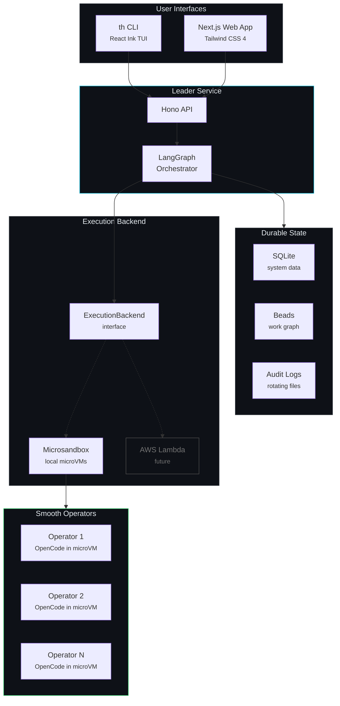
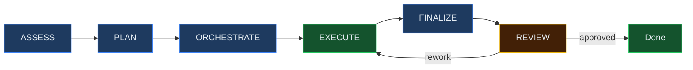

<div align="center">


# Smooth

**The Smoo AI CLI — Agent Orchestration & Platform Tools**

Coordinate teams of AI agents to build, research, analyze, and ship.
One CLI for everything Smoo AI.

[](https://www.npmjs.com/package/@smooai/smooth-cli)
[](LICENSE)
[](https://www.typescriptlang.org/)
[](https://langchain-ai.github.io/langgraphjs/)

</div>

---

## What is Smooth?

Smooth is the central CLI and orchestration platform for [Smoo AI](https://smoo.ai). It does two things:

1. **Agent Orchestration** — Spin up teams of AI agents (Smooth Operators) that work on real projects inside hardware-isolated sandboxes. They assess, plan, execute, and review work autonomously with structured adversarial review.

2. **Smoo AI Platform CLI** — Manage config schemas, interact with the SmooAI API, sync with Jira, and control your Smoo AI infrastructure from one command.

### Why sandboxed agents?

AI agents that write code, run tests, and modify files need real isolation — not just Docker namespaces. Smooth runs each operator in a [Microsandbox](https://microsandbox.dev) microVM with hardware-level isolation via hypervisor. They can't escape, can't damage the host, and can't interfere with each other. You get the freedom of letting agents do real work with the safety of knowing they're truly contained.

### What can Smooth Operators do?

Anything you can describe:

- **Coding** — Write features, fix bugs, refactor code, add tests across any repo
- **Research** — Investigate codebases, analyze architectures, produce reports
- **Testing** — Run test suites, identify coverage gaps, write missing tests
- **Documentation** — Generate docs, READMEs, architecture decision records
- **Analysis** — Review PRs, audit dependencies, assess security posture
- **Operations** — Manage deployments, sync configurations, triage issues

The tool system is extensible — add custom MCP tools for your specific workflows.

### How it works

You describe work to the leader. The leader breaks it down, assigns Smooth Operators, and they execute through a structured lifecycle:

```
ASSESS → PLAN → ORCHESTRATE → EXECUTE → FINALIZE → REVIEW (adversarial)
```

Every piece of work gets adversarial review from a separate operator that challenges assumptions, checks for edge cases, and either approves, requests rework, or rejects. All state is durable through [Beads](https://github.com/SmooAI/beads) — nothing gets lost.

---

## Install

```bash
npm install -g @smooai/smooth-cli
```

## Quick Start

```bash
# 1. Authenticate with your LLM provider
th auth login anthropic --api-key sk-ant-...

# 2. Start Smooth
th up

# 3. Open the terminal UI
th tui
```

No Docker. No PostgreSQL. No external services. Just Node.js. Microsandbox auto-installs on first `th up`.

---

## The `th` CLI

### Authentication

Supports the same providers as OpenCode — use whichever LLM you prefer:

```bash
th auth login anthropic          # Claude
th auth login openai             # GPT-4
th auth login openrouter         # Multi-model routing
th auth login groq               # Fast inference
th auth login google             # Gemini
th auth login opencode-zen       # OpenCode Zen subscription
th auth providers                # Show configured providers
th auth status                   # Full auth overview
```

### Orchestration

```bash
th up                            # Start everything (auto-installs Microsandbox)
th down                          # Stop
th status                        # System health
th tui                           # Full terminal UI (8 views + chat)
th web                           # Open web interface
```

### Work Management

```bash
th project create <name>         # Create a project
th run <bead-id>                 # Trigger work on a bead
th approve <bead-id>             # Approve a review
th inbox                         # Messages needing attention
th operators                     # Active Smooth Operators
```

### Smoo AI Platform

```bash
th smoo config push              # Push config schema to platform
th smoo config pull              # Pull config values
th smoo config set <key> <value> # Set config value
th smoo config list              # List all values
th smoo agents                   # List SmooAI agents
th jira sync                     # Bidirectional Jira sync
```

### System

```bash
th config show                   # Local settings
th db status                     # Database info
th db backup                     # Backup SQLite
th tailscale status              # Tailscale node info
```

---

## Architecture



The **leader** (LangGraph + Hono) orchestrates **Smooth Operators** (OpenCode in Microsandbox microVMs). **Beads** is the durable system of record for all work state. **SQLite** handles system data. The execution layer is pluggable — local Microsandbox today, AWS Lambda for hosted customer workloads in the future.

### Operator Lifecycle



## Packages

| Package | Description |
|---|---|
| [`@smooai/smooth-cli`](https://www.npmjs.com/package/@smooai/smooth-cli) | `th` CLI binary + React Ink TUI |
| [`@smooai/smooth-leader`](https://www.npmjs.com/package/@smooai/smooth-leader) | LangGraph orchestration service |
| [`@smooai/smooth-shared`](https://www.npmjs.com/package/@smooai/smooth-shared) | Shared types + Zod schemas |
| [`@smooai/smooth-db`](https://www.npmjs.com/package/@smooai/smooth-db) | SQLite via Drizzle ORM |
| [`@smooai/smooth-tools`](https://www.npmjs.com/package/@smooai/smooth-tools) | MCP tools for Smooth Operators |
| [`@smooai/smooth-auth`](https://www.npmjs.com/package/@smooai/smooth-auth) | Better Auth (SQLite) |
| [`@smooai/smooth-smoo-api`](https://www.npmjs.com/package/@smooai/smooth-smoo-api) | SmooAI M2M API client |

## Tech Stack

| | |
|---|---|
| **Orchestration** | LangGraph, Hono, Zod |
| **Smooth Operators** | OpenCode, Microsandbox microVMs |
| **Storage** | SQLite (Drizzle ORM), Beads |
| **Web** | Next.js 16, React 19, Tailwind CSS 4 |
| **CLI** | React Ink 6, Commander.js |
| **Auth** | Multi-provider LLM auth, Better Auth, Tailscale |
| **Config** | @smooai/config integration |

## Development

```bash
git clone https://github.com/SmooAI/smooth.git
cd smooth
pnpm install
pnpm build && pnpm test
```

## License

MIT - [Smoo AI](https://smoo.ai)
