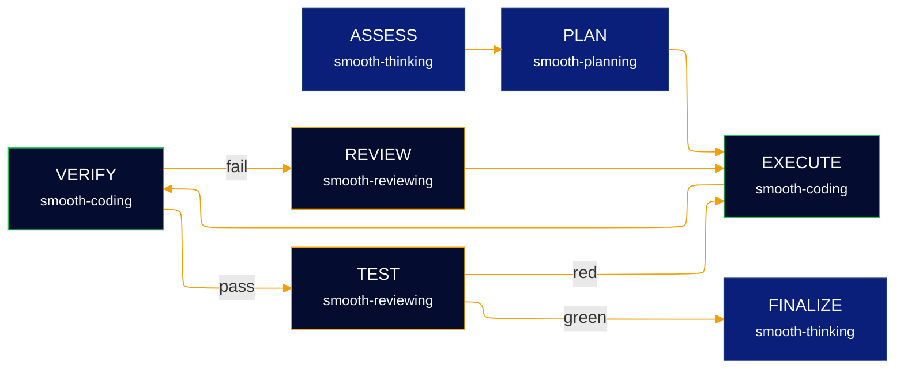
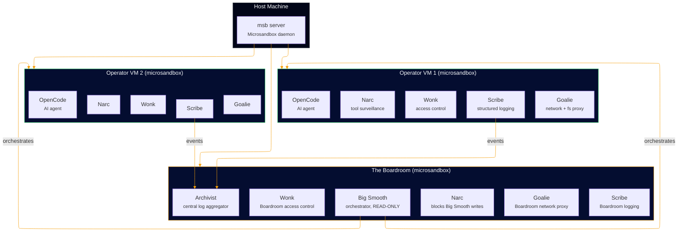
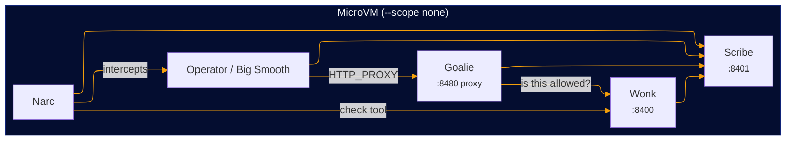
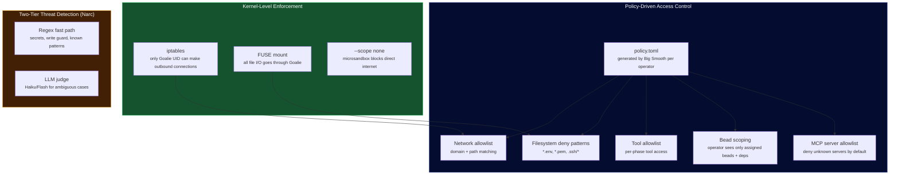
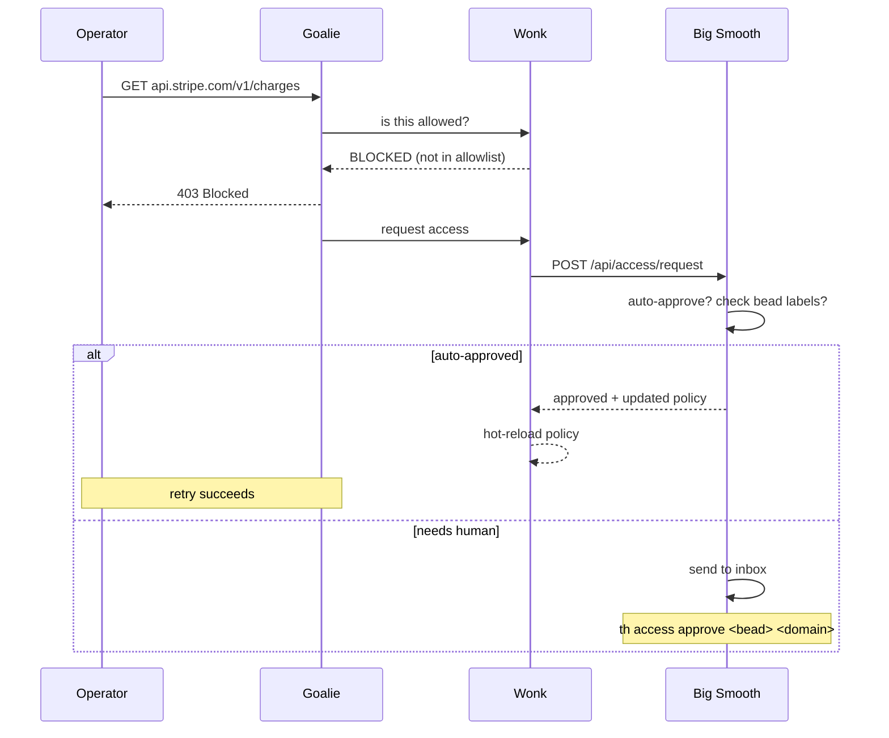
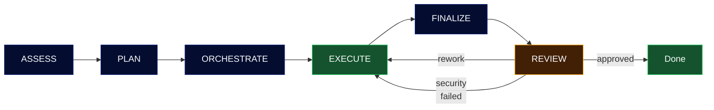

<div align="center">


# Smooth

**The Smoo AI CLI — Agent Orchestration & Platform Tools**

Coordinate teams of AI agents to build, research, analyze, and ship.
One binary for everything Smoo AI.

[](LICENSE)
[](https://www.rust-lang.org/)
[](https://github.com/SmooAI/smooth/releases)

</div>

---

## About Smoo AI

**[Smoo AI](https://smoo.ai)** is an AI platform that helps businesses multiply their customer, employee, and developer experience — conversational AI for support and sales, paired with the production-grade developer tooling we use to build it.

Smooth is part of a small family of open-source packages we maintain to keep our own stack honest: contextual logging, typed HTTP, file storage, and agent orchestration. Use them in your stack, or take them as a reference for how we build.

- 🌐 [smoo.ai](https://smoo.ai) — the product
- 📦 [smoo.ai/open-source](https://smoo.ai/open-source) — every open-source package we ship
- 🐙 [github.com/SmooAI](https://github.com/SmooAI) — the source

---

## Install

```bash
curl -fsSL https://raw.githubusercontent.com/SmooAI/smooth/main/install.sh | sh
```

Or build from source:

```bash
git clone https://github.com/SmooAI/smooth.git
cd smooth
cargo install --path crates/smooth-cli
```

## Quick Start

```bash
# Authenticate with your LLM provider
th auth login opencode-zen

# Start Smooth (Big Smooth API + embedded web dashboard)
th up

# Open the interactive coding assistant
th code
```

No Docker. No Node.js. No runtime dependencies. One 10MB binary.

---

## What is Smooth?

Smooth is the central CLI and orchestration platform for [Smoo AI](https://smoo.ai). It does two things:

1. **Agent Orchestration** — Spin up teams of AI agents (Smooth Operators) that work on real projects inside hardware-isolated Microsandbox microVMs. They assess, plan, execute, and review work autonomously with adversarial security review.

2. **Smoo AI Platform CLI** — Manage config schemas, interact with the SmooAI API, sync with Jira, and control your infrastructure from one command.

### How it works

Smooth spawns teams of AI agents called **Smooth Operators** that work inside isolated microVMs. Each operator runs a structured, multi-phase coding workflow — and every phase routes through a different model tuned for the shape of that phase's work.



**Per-phase routing** — each phase dispatches through a semantic routing slot, so the gateway can pick the right concrete model for the shape of work:

| Phase | Slot | What it does |
|---|---|---|
| **ASSESS** | `smooth-thinking` | Deep read of tests + stub + docs; crystallize a 2–4 sentence Goal Summary every later phase sees |
| **PLAN** | `smooth-planning` | Decompose into implementation steps |
| **EXECUTE** | `smooth-coding` | Write code using the repo's existing tools (pnpm scripts, Cargo targets, Makefile, CI commands — not generic defaults). Self-validate before stopping. |
| **VERIFY** | `smooth-coding` | Run the test command, report pass/fail verbatim |
| **REVIEW** | `smooth-reviewing` | Adversarial critique; may refine the Goal Summary if understanding drifted |
| **TEST** | `smooth-reviewing` | **The differentiator.** After provided tests pass, classify the code and raise the bar with real coverage — MSW for HTTP mocking, Playwright for real browser flows, testcontainers for DBs, property-based (hypothesis/proptest/fast-check) for pure libraries. Uses the repo's existing framework; doesn't force new deps on a Rust crate or suggest Playwright for a pure CLI. |
| **FINALIZE** | `smooth-thinking` | Holistic check against the Goal Summary, not just the test results |

**What makes this different.** Most agentic coders bang on the given tests until green. Smooth's TEST phase is adversarial: it classifies what the code actually is (API client? React component? WebSocket? CLI?), inspects what the repo already uses, and then exercises real boundaries — intercepting `fetch` with MSW to test the retry loop, booting a Playwright browser to click the real flow, faking the clock for timer-driven code. If those new tests expose real bugs, the workflow loops back to EXECUTE. If they're clean, it moves on.

**Loop governor.** Stop conditions are budget + plateau, not a fixed iteration cap. `verify_signature` extracts pass/fail counts from each VERIFY and breaks early when the signature repeats (model going in circles). A budget short-circuit breaks when the next iteration would blow the cap. The iteration cap is a safety ceiling, not the primary brake.

**Live status.** The TUI streams an `AgentEvent::PhaseStart` on each phase entry and shows the phase + routing alias + resolved upstream model + a rotating thesaurus phrase in the status bar:

```
ASSESS · smooth-thinking → kimi-k2-thinking | Pondering… | tokens: 1.2k | spend: $0.003
```

All state is durable through Smooth's built-in pearl tracker (Dolt-backed per-project, git-syncable).

---

## Architecture



### The Cast

Everything runs inside [Microsandbox](https://github.com/nicholasgasior/microsandbox) microVMs — including the orchestrator.

| Service | Role | Where it runs |
|---|---|---|
| **Big Smooth** | Orchestrator. Schedules work, generates policies, handles access requests. **READ-ONLY** — cannot write to the filesystem. | The Boardroom |
| **Archivist** | Central log + trace aggregator. Receives events and OTLP traces from all Scribes. Stores traces in SQLite, optionally forwards to external OTel backends (Jaeger, Tempo, Honeycomb). Can write, but only to log paths. | The Boardroom |
| **Wonk** | Access control authority. Reads policy TOML, answers "is this allowed?" for every network request, tool call, bead access, and CLI command. No LLM. | Every VM |
| **Goalie** | Network + filesystem proxy. Dumb pipe — forwards or blocks based on Wonk's answer. iptables + FUSE enforced at kernel level. | Every VM |
| **Narc** | Tool surveillance + prompt injection guard. Two-tier detection: fast regex pre-filters + LLM-as-a-judge for ambiguous cases. | Every VM |
| **Scribe** | Structured logging service. All services log through Scribe, which writes to on-pod SQLite and feeds Archivist. | Every VM |
| **Groove** | LLM checkpointing + session resume. Captures conversation state after tool calls and phase transitions. Enables interrupted operators to resume from last checkpoint. | Every VM |

**The Board** = Big Smooth + Archivist (leadership). **The Boardroom** = the VM where The Board operates, with its own Wonk, Goalie, Narc, Scribe, and Groove.

**Smooth Operators** = the AI agents. The only ones who write code.

### Inside each MicroVM



- **Wonk** reads `/etc/smooth/policy.toml`, listens on `127.0.0.1:8400`, hot-reloads on file change
- **Goalie** listens on `127.0.0.1:8480` as HTTP proxy. iptables rejects all outbound TCP except from the Goalie UID. FUSE mount at `/workspace` for filesystem access control.
- **Narc** intercepts tool calls and incoming prompts. Regex fast path catches obvious secrets and write violations. Ambiguous cases go to a small/fast LLM (Haiku, Flash, GPT-4o-mini) for a yes/no verdict.
- **Scribe** listens on `127.0.0.1:8401`, writes to on-pod SQLite and JSON-lines, feeds events to Archivist. Bridges `tracing` spans to OpenTelemetry via `tracing-opentelemetry`, generating trace hierarchies for operator lifecycles, prompts, tool calls, and network requests. Exports OTLP traces to Archivist with W3C traceparent propagation across VM boundaries.

### Security Model



**Key invariants:**
- Big Smooth **never writes**. Narc in the Boardroom enforces this — any write attempt is instantly blocked.
- Archivist **can write**, but only to log paths. Writes to any other path are blocked.
- Operators can only see their assigned beads and dependencies (scoped by auth token).
- All outbound traffic goes through Goalie. No process can bypass the proxy — enforced at the kernel level.

### Continuous Access Negotiation

Operators can request expanded access at runtime. The flow:



### Operator Lifecycle



### Phase-Based Access Defaults

| Phase | Network | Filesystem | Beads |
|---|---|---|---|
| Assess | LLM + registries | Read-only | Own bead + deps (depth 1) |
| Plan | LLM + registries | Read-only | Own bead + deps (depth 2) |
| Orchestrate | LLM + registries + leader | Read-only | Own bead + deps (depth 2) |
| Execute | LLM + registries + GitHub | Read-write | Own bead + deps (depth 2) |
| Finalize | LLM + registries + GitHub | Read-write | Own bead + deps (depth 2) |
| Review | LLM + registries | Read-only | Target bead + own bead |

---

## The `th` CLI

### Core

```bash
th up                            # Start everything
th down                          # Stop
th status                        # System health
th code                          # Interactive coding assistant (ratatui)
```

### Authentication

```bash
th auth login opencode-zen       # OpenCode Zen (Claude, GPT, Gemini, etc.)
th auth login anthropic          # Direct Anthropic API
th auth status                   # Show all auth status
th auth providers                # List configured providers
```

### Work

```bash
th run <bead-id>                 # Trigger work on a bead
th operators                     # List active Smooth Operators
th pause/resume/steer/cancel     # Control operators mid-task
th approve <bead-id>             # Approve a review
th inbox                         # Messages needing attention
```

### Access Control

```bash
th access pending                # List pending access requests
th access approve <bead> <domain>  # Approve domain access
th access deny <bead> <domain>     # Deny domain access
th access policy <operator-id>     # Show current policy
```

### Tools & Plugins

```bash
# MCP servers (Playwright, GitHub, filesystem, etc.)
th mcp add playwright npx @playwright/mcp@latest
th mcp add --project repo-fs npx @modelcontextprotocol/server-filesystem /workspace
th mcp list                      # Global + project scopes
th mcp test playwright           # Health check
th mcp remove playwright

# CLI-wrapper plugins — shell commands exposed as agent tools
th plugin init jq --command 'jq {{filter}} <<< {{json}}'
th plugin init --project deploy --command 'scripts/deploy.sh {{env}}'
th plugin list
th plugin remove deploy --project
```

Global config lives at `~/.smooth/`; project config at
`<repo>/.smooth/`. Project entries shadow global on name collision.
See [`docs/extending.md`](docs/extending.md) for the full guide.

### Run a pearl in a sandbox (`th run`)

Dispatch a pearl (or ad-hoc prompt) to a Smooth Operator running in a
microVM. The agent has bind-mount access to your workspace, a
project-scoped cache at `/opt/smooth/cache`, and (with `--keep-alive`)
forwarded ports so you can review dev servers live.

```bash
# First ready pearl, default image
th run --keep-alive

# Explicit pearl, explicit memory
th run th-abcdef --keep-alive --memory-mb 6144

# Ad-hoc prompt against the current directory
th run "add a /health route that returns {\"ok\":true}" --keep-alive

# Inspect + tear down
th operators list
th operators kill <operator-id>
```

**One image for every stack.** `smooai/smooth-operator` ships with
alpine + `mise` baked in. The agent reads the workspace
(`package.json`, `Cargo.toml`, `pyproject.toml`, `go.mod`) and
installs whatever toolchain it needs at runtime — node + pnpm,
python + uv, rust, go, bun, deno, or any of the ~140 tools mise
supports. Installs land in `/opt/smooth/cache/mise`, bound to the
host project cache so second-run starts are offline-fast.

Build locally:

```bash
scripts/build-smooth-operator-image.sh
```

Override via `--image` or `SMOOTH_OPERATOR_IMAGE` env if you want a
custom variant (e.g. a version pinned for CI reproducibility).

**Microsandbox image resolution.** Locally-built images live in
your Docker Desktop image store; `microsandbox` pulls from registries
by default, so if its pull can't see your local build, push it
first (`docker push smooai/smooth-operator:0.2.0`) or set
`SMOOTH_WORKER_IMAGE` to something microsandbox can reach.

**Project cache.** Each workspace path hashes to its own cache dir
at `~/.smooth/project-cache/<name>-<hash>/`. Subsequent runs on the
same repo share mise installs + language stores (pnpm-store, cargo
registry, uv cache, etc.). Manage with:

```bash
th cache list
th cache prune --older-than 30     # evict caches idle > N days
th cache clear /path/to/project
```

### Background service

Keep `th up` running across reboots via the native service manager
(user-level; no sudo, no system daemons).

```bash
th service install               # LaunchAgent (macOS) / systemd --user (Linux) / logon task (Windows)
th service start / stop / restart
th service status
th service logs -f               # Tail ~/.smooth/service.log
th service uninstall
th service install --system      # Print the system-level artifact + install instructions
```

### System

```bash
th db status                     # Database info
th db backup                     # Backup SQLite
th audit tail leader             # View audit logs
th tailscale status              # Tailscale info
th worktree create/list/merge    # Git worktrees
```

---

## Extending Smooth

Two extension points add tools without rebuilding the binary:

- **MCP servers** — spawn [Model Context
  Protocol](https://modelcontextprotocol.io) servers like Playwright
  MCP or GitHub MCP; their tools land in the agent's registry as
  `<server>.<tool>`.
- **CLI-wrapper plugins** — drop a TOML manifest at
  `.smooth/plugins/<name>/plugin.toml` and the runner registers it as
  `plugin.<name>`, rendering `{{placeholder}}` args into a shell
  command template.

Both are configurable globally (`~/.smooth/`) and per-project
(`<repo>/.smooth/`). Project entries shadow global ones. There's
**no trust gate** on loading these — consistent with `npm install`,
`.zshrc`, or cloning any repo and running `pnpm dev`. Defense-in-depth
happens at *call time*: Narc's CliGuard / injection / secret
detectors gate every tool invocation, Wonk policy gates every
network + filesystem access, and the whole agent loop runs inside
a hardware-isolated microVM. See [`docs/extending.md`](docs/extending.md)
and [`SECURITY.md`](SECURITY.md).

---

## Tech Stack

| | |
|---|---|
| **Language** | Rust 2021 edition |
| **HTTP** | axum + tower |
| **Database** | rusqlite (bundled SQLite) |
| **TUI** | ratatui + crossterm |
| **Web** | React 19 + Vite + Tailwind CSS 4 (embedded) |
| **Markdown** | pulldown-cmark (TUI), react-markdown (web) |
| **Sandboxes** | Microsandbox (hardware-isolated microVMs) |
| **Agent framework** | smooth-operator (Rust-native, built-in checkpointing) |
| **LLM** | OpenAI-compatible (OpenCode Zen, Anthropic, OpenAI) |
| **Work tracking** | Beads (durable SoR) |
| **Policy** | TOML-based, hot-reloadable via notify + ArcSwap |
| **Logging** | smooai-logger (structured, context-aware) |
| **Tracing** | OpenTelemetry (tracing-opentelemetry bridge, OTLP export) |
| **Linting** | clippy (pedantic + nursery) |
| **Formatting** | rustfmt (160 max width) |

## Workspace

```
smooth/
├── crates/
│   ├── smooth-cli/          # Binary — clap CLI (27 commands)
│   ├── smooth-bigsmooth/    # Library — orchestrator, policy gen, session mgmt
│   ├── smooth-operator/     # Library — Rust-native AI agent framework
│   ├── smooth-policy/       # Library — shared policy types, TOML parsing
│   ├── smooth-wonk/         # Binary — in-VM access control authority
│   ├── smooth-goalie/       # Binary — in-VM network + filesystem proxy
│   ├── smooth-narc/         # Library — tool surveillance + secret detection
│   ├── smooth-scribe/       # Library — per-VM structured logging
│   ├── smooth-archivist/    # Library — central log aggregator
│   ├── smooth-code/         # Library — ratatui terminal dashboard
│   └── smooth-web/          # Library — embedded Vite SPA
│       └── web/             # React + Vite source
├── Cargo.toml               # Workspace root
├── rustfmt.toml             # Format config
└── install.sh               # Curl installer
```

## Development

```bash
# Build
cargo build

# Test (200+ tests across 10 crates)
cargo test

# Format
cargo fmt

# Lint
cargo clippy

# Run dev (with auto-reload)
cargo watch -x 'run -p smooth-cli -- up'

# Release build (~10MB)
cargo build --release -p smooth-cli
ls -lh target/release/th
```

## License

MIT - [Smoo AI](https://smoo.ai)
