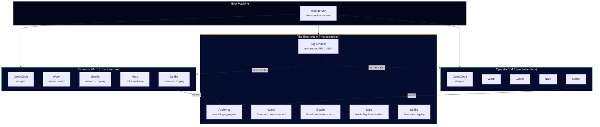
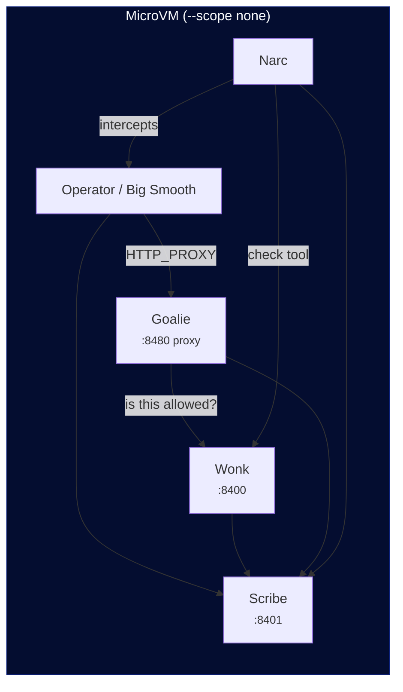
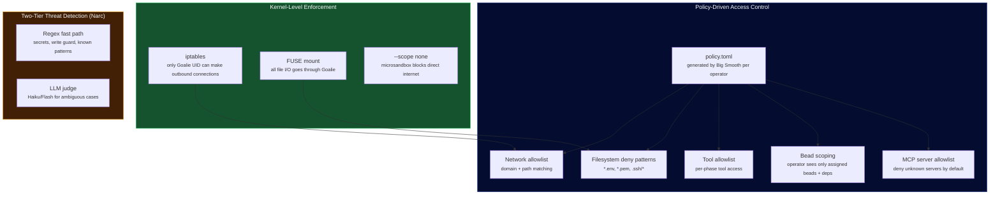
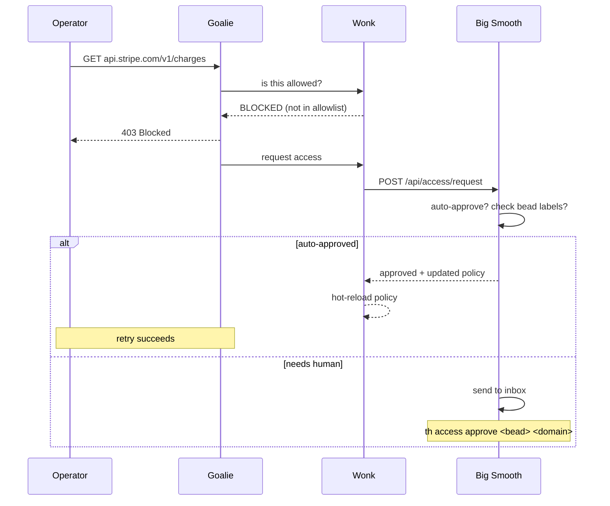
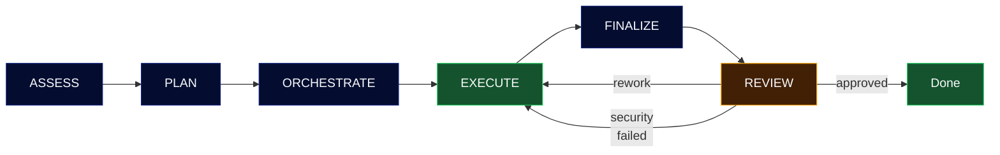

<div align="center">


# Smooth

**The Smoo AI CLI — Agent Orchestration & Platform Tools**

Coordinate teams of AI agents to build, research, analyze, and ship.
One binary for everything Smoo AI.

[](LICENSE)
[](https://www.rust-lang.org/)
[](https://github.com/SmooAI/smooth/releases)

</div>

---

## Install

```bash
curl -fsSL https://raw.githubusercontent.com/SmooAI/smooth/main/install.sh | sh
```

Or build from source:

```bash
git clone https://github.com/SmooAI/smooth.git
cd smooth
cargo install --path crates/smooth-cli
```

## Quick Start

```bash
# Authenticate with your LLM provider
th auth login opencode-zen

# Start Smooth (leader API + embedded web dashboard)
th up

# Open the terminal UI
th tui
```

No Docker. No Node.js. No runtime dependencies. One 10MB binary.

---

## What is Smooth?

Smooth is the central CLI and orchestration platform for [Smoo AI](https://smoo.ai). It does two things:

1. **Agent Orchestration** — Spin up teams of AI agents (Smooth Operators) that work on real projects inside hardware-isolated Microsandbox microVMs. They assess, plan, execute, and review work autonomously with adversarial security review.

2. **Smoo AI Platform CLI** — Manage config schemas, interact with the SmooAI API, sync with Jira, and control your infrastructure from one command.

### How it works

```
ASSESS → PLAN → ORCHESTRATE → EXECUTE → FINALIZE → REVIEW (adversarial)
```

Every piece of work gets adversarial review from a separate operator that challenges assumptions, checks for security issues, and either approves, requests rework, or rejects. All state is durable through [Beads](https://github.com/SmooAI/beads).

---

## Architecture



### The Cast

Everything runs inside [Microsandbox](https://github.com/nicholasgasior/microsandbox) microVMs — including the orchestrator.

| Service | Role | Where it runs |
|---|---|---|
| **Big Smooth** | Orchestrator. Schedules work, generates policies, handles access requests. **READ-ONLY** — cannot write to the filesystem. | The Boardroom |
| **Archivist** | Central log + trace aggregator. Receives events and OTLP traces from all Scribes. Stores traces in SQLite, optionally forwards to external OTel backends (Jaeger, Tempo, Honeycomb). Can write, but only to log paths. | The Boardroom |
| **Wonk** | Access control authority. Reads policy TOML, answers "is this allowed?" for every network request, tool call, bead access, and CLI command. No LLM. | Every VM |
| **Goalie** | Network + filesystem proxy. Dumb pipe — forwards or blocks based on Wonk's answer. iptables + FUSE enforced at kernel level. | Every VM |
| **Narc** | Tool surveillance + prompt injection guard. Two-tier detection: fast regex pre-filters + LLM-as-a-judge for ambiguous cases. | Every VM |
| **Scribe** | Structured logging service. All services log through Scribe, which writes to on-pod SQLite and feeds Archivist. | Every VM |
| **Groove** | LLM checkpointing + session resume. Captures conversation state after tool calls and phase transitions. Enables interrupted operators to resume from last checkpoint. | Every VM |

**The Board** = Big Smooth + Archivist (leadership). **The Boardroom** = the VM where The Board operates, with its own Wonk, Goalie, Narc, Scribe, and Groove.

**Smooth Operators** = the AI agents. The only ones who write code.

### Inside each MicroVM



- **Wonk** reads `/etc/smooth/policy.toml`, listens on `127.0.0.1:8400`, hot-reloads on file change
- **Goalie** listens on `127.0.0.1:8480` as HTTP proxy. iptables rejects all outbound TCP except from the Goalie UID. FUSE mount at `/workspace` for filesystem access control.
- **Narc** intercepts tool calls and incoming prompts. Regex fast path catches obvious secrets and write violations. Ambiguous cases go to a small/fast LLM (Haiku, Flash, GPT-4o-mini) for a yes/no verdict.
- **Scribe** listens on `127.0.0.1:8401`, writes to on-pod SQLite and JSON-lines, feeds events to Archivist. Bridges `tracing` spans to OpenTelemetry via `tracing-opentelemetry`, generating trace hierarchies for operator lifecycles, prompts, tool calls, and network requests. Exports OTLP traces to Archivist with W3C traceparent propagation across VM boundaries.

### Security Model



**Key invariants:**
- Big Smooth **never writes**. Narc in the Boardroom enforces this — any write attempt is instantly blocked.
- Archivist **can write**, but only to log paths. Writes to any other path are blocked.
- Operators can only see their assigned beads and dependencies (scoped by auth token).
- All outbound traffic goes through Goalie. No process can bypass the proxy — enforced at the kernel level.

### Continuous Access Negotiation

Operators can request expanded access at runtime. The flow:



### Operator Lifecycle



### Phase-Based Access Defaults

| Phase | Network | Filesystem | Beads |
|---|---|---|---|
| Assess | LLM + registries | Read-only | Own bead + deps (depth 1) |
| Plan | LLM + registries | Read-only | Own bead + deps (depth 2) |
| Orchestrate | LLM + registries + leader | Read-only | Own bead + deps (depth 2) |
| Execute | LLM + registries + GitHub | Read-write | Own bead + deps (depth 2) |
| Finalize | LLM + registries + GitHub | Read-write | Own bead + deps (depth 2) |
| Review | LLM + registries | Read-only | Target bead + own bead |

---

## The `th` CLI

### Core

```bash
th up                            # Start everything
th down                          # Stop
th status                        # System health
th tui                           # Terminal UI (ratatui)
```

### Authentication

```bash
th auth login opencode-zen       # OpenCode Zen (Claude, GPT, Gemini, etc.)
th auth login anthropic          # Direct Anthropic API
th auth status                   # Show all auth status
th auth providers                # List configured providers
```

### Work

```bash
th run <bead-id>                 # Trigger work on a bead
th operators                     # List active Smooth Operators
th pause/resume/steer/cancel     # Control operators mid-task
th approve <bead-id>             # Approve a review
th inbox                         # Messages needing attention
```

### Access Control

```bash
th access pending                # List pending access requests
th access approve <bead> <domain>  # Approve domain access
th access deny <bead> <domain>     # Deny domain access
th access policy <operator-id>     # Show current policy
```

### System

```bash
th db status                     # Database info
th db backup                     # Backup SQLite
th audit tail leader             # View audit logs
th tailscale status              # Tailscale info
th worktree create/list/merge    # Git worktrees
```

---

## Tech Stack

| | |
|---|---|
| **Language** | Rust 2021 edition |
| **HTTP** | axum + tower |
| **Database** | rusqlite (bundled SQLite) |
| **TUI** | ratatui + crossterm |
| **Web** | React 19 + Vite + Tailwind CSS 4 (embedded) |
| **Markdown** | pulldown-cmark (TUI), react-markdown (web) |
| **Sandboxes** | Microsandbox (hardware-isolated microVMs) |
| **LLM** | OpenCode Zen API (OpenAI-compatible) |
| **Work tracking** | Beads (durable SoR) |
| **Policy** | TOML-based, hot-reloadable via notify + ArcSwap |
| **Logging** | smooai-logger (structured, context-aware) |
| **Tracing** | OpenTelemetry (tracing-opentelemetry bridge, OTLP export) |
| **Linting** | clippy (pedantic + nursery) |
| **Formatting** | rustfmt (160 max width) |

## Workspace

```
smooth/
├── crates/
│   ├── smooth-cli/          # Binary — clap CLI (23 commands)
│   ├── smooth-bigsmooth/    # Library — orchestrator, policy generation
│   ├── smooth-policy/       # Library — shared policy types, TOML parsing
│   ├── smooth-wonk/         # Binary — in-VM access control authority
│   ├── smooth-goalie/       # Binary — in-VM network + filesystem proxy
│   ├── smooth-narc/         # Binary — in-VM tool surveillance + LLM judge
│   ├── smooth-scribe/       # Binary — in-VM structured logging + OTel
│   ├── smooth-archivist/    # Binary — central log + trace aggregator
│   ├── smooth-groove/       # Binary — in-VM LLM checkpointing + session resume
│   ├── smooth-tui/          # Library — ratatui terminal dashboard
│   └── smooth-web/          # Library — embedded Vite SPA
│       └── web/             # React + Vite source
├── Cargo.toml               # Workspace root
├── rustfmt.toml             # Format config
└── install.sh               # Curl installer
```

## Development

```bash
# Build
cargo build

# Test (35 tests)
cargo test

# Format
cargo fmt

# Lint
cargo clippy

# Run dev (with auto-reload)
cargo watch -x 'run -p smooth-cli -- up'

# Release build (~10MB)
cargo build --release -p smooth-cli
ls -lh target/release/th
```

## License

MIT - [Smoo AI](https://smoo.ai)
