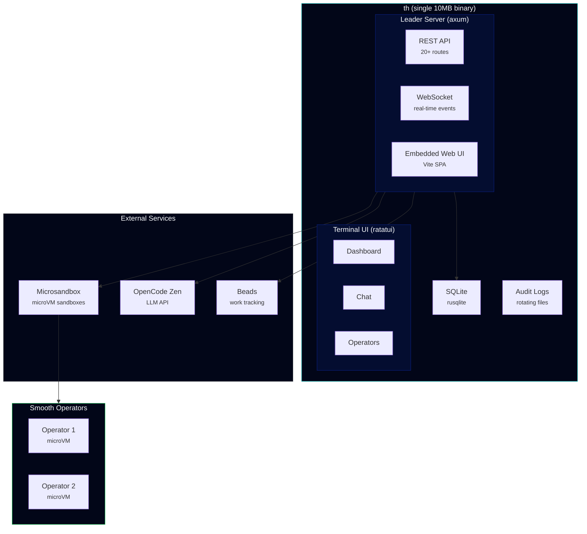
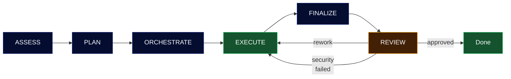

<div align="center">


# Smooth

**The Smoo AI CLI — Agent Orchestration & Platform Tools**

Coordinate teams of AI agents to build, research, analyze, and ship.
One binary for everything Smoo AI.

[](LICENSE)
[](https://www.rust-lang.org/)
[](https://github.com/SmooAI/smooth/releases)

</div>

---

## Install

```bash
curl -fsSL https://raw.githubusercontent.com/SmooAI/smooth/main/install.sh | sh
```

Or build from source:

```bash
git clone https://github.com/SmooAI/smooth.git
cd smooth
cargo install --path crates/smooth-cli
```

## Quick Start

```bash
# Authenticate with your LLM provider
th auth login opencode-zen

# Start Smooth (leader API + embedded web dashboard)
th up

# Open the terminal UI
th tui
```

No Docker. No Node.js. No runtime dependencies. One 10MB binary.

---

## What is Smooth?

Smooth is the central CLI and orchestration platform for [Smoo AI](https://smoo.ai). It does two things:

1. **Agent Orchestration** — Spin up teams of AI agents (Smooth Operators) that work on real projects inside hardware-isolated Microsandbox microVMs. They assess, plan, execute, and review work autonomously with adversarial security review.

2. **Smoo AI Platform CLI** — Manage config schemas, interact with the SmooAI API, sync with Jira, and control your infrastructure from one command.

### How it works

```
ASSESS → PLAN → ORCHESTRATE → EXECUTE → FINALIZE → REVIEW (adversarial)
```

Every piece of work gets adversarial review from a separate operator that challenges assumptions, checks for security issues, and either approves, requests rework, or rejects. All state is durable through [Beads](https://github.com/SmooAI/beads).

---

## Architecture



**`th up` starts two servers from a single binary:**
- Leader API on `:4400` — REST + WebSocket for all orchestration
- Web UI on `:3100` — embedded React/Vite dashboard (compiled into the binary)

### Operator Lifecycle



---

## The `th` CLI

### Core

```bash
th up                            # Start everything
th down                          # Stop
th status                        # System health
th tui                           # Terminal UI (ratatui)
```

### Authentication

```bash
th auth login opencode-zen       # OpenCode Zen (Claude, GPT, Gemini, etc.)
th auth login anthropic          # Direct Anthropic API
th auth status                   # Show all auth status
th auth providers                # List configured providers
```

### Work

```bash
th run <bead-id>                 # Trigger work on a bead
th operators                     # List active Smooth Operators
th pause/resume/steer/cancel     # Control operators mid-task
th approve <bead-id>             # Approve a review
th inbox                         # Messages needing attention
```

### System

```bash
th db status                     # Database info
th db backup                     # Backup SQLite
th audit tail leader             # View audit logs
th tailscale status              # Tailscale info
th worktree create/list/merge    # Git worktrees
```

---

## Tech Stack

| | |
|---|---|
| **Language** | Rust 2021 edition |
| **HTTP** | axum + tower |
| **Database** | rusqlite (bundled SQLite) |
| **TUI** | ratatui + crossterm |
| **Web** | React 19 + Vite + Tailwind CSS 4 (embedded) |
| **Markdown** | pulldown-cmark (TUI), react-markdown (web) |
| **Sandboxes** | Microsandbox (hardware-isolated microVMs) |
| **LLM** | OpenCode Zen API (OpenAI-compatible) |
| **Work tracking** | Beads (durable SoR) |
| **Linting** | clippy (pedantic + nursery) |
| **Formatting** | rustfmt (160 max width) |

## Workspace

```
smooth/
├── crates/
│   ├── smooth-cli/          # Binary — clap CLI (23 commands)
│   ├── smooth-leader/       # Library — axum server, orchestrator, sandbox
│   ├── smooth-tui/          # Library — ratatui terminal dashboard
│   └── smooth-web/          # Library — embedded Vite SPA
│       └── web/             # React + Vite source
├── Cargo.toml               # Workspace root
├── rustfmt.toml             # Format config
└── install.sh               # Curl installer
```

## Development

```bash
# Build
cargo build

# Test (35 tests)
cargo test

# Format
cargo fmt

# Lint
cargo clippy

# Run dev
cargo run -p smooth-cli -- up

# Release build (~10MB)
cargo build --release -p smooth-cli
ls -lh target/release/th
```

## License

MIT - [Smoo AI](https://smoo.ai)
