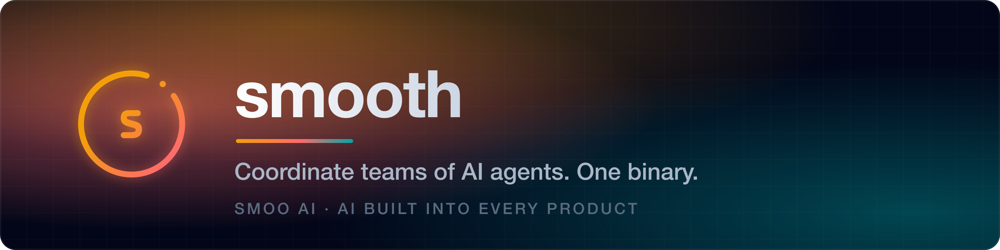
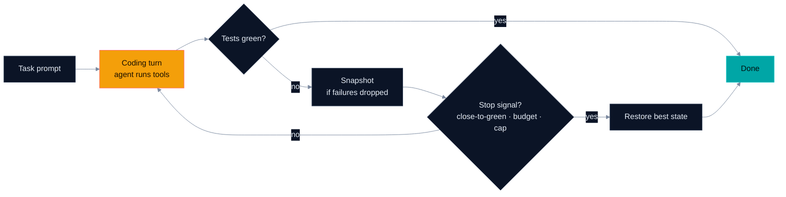

<p align="center">
  <a href="https://smoo.ai"></a>
</p>

<p align="center">
  <a href="docs/bench-history.md"></a>
  <a href="https://smoo.ai"></a>
  <a href="LICENSE"></a>
</p>

<p align="center">
  <a href="https://www.rust-lang.org/"></a>
  <a href="https://github.com/SmooAI/smooth/releases"></a>
</p>

<p align="center">
  <a href="#install"><b>Install</b></a> &nbsp;·&nbsp; <a href="#quick-start"><b>Quick Start</b></a> &nbsp;·&nbsp; <a href="#what-is-smooth"><b>What is Smooth</b></a> &nbsp;·&nbsp; <a href="#architecture"><b>Architecture</b></a> &nbsp;·&nbsp; <a href="#the-th-cli"><b>CLI</b></a> &nbsp;·&nbsp; <a href="#-part-of-smoo-ai"><b>Platform</b></a>
</p>

---

> Smooth is the central CLI and orchestration platform for Smoo AI. It dispatches teams of AI agents — Smooth operatives — to work on real projects, with adversarial tool surveillance. No Docker. No Node.js. No runtime dependencies. One 10MB binary.

---

## Install

### Homebrew (recommended, macOS + Linux)

```bash
brew install SmooAI/tools/th

# verify
th --version
```

That taps [SmooAI/homebrew-tools](https://github.com/SmooAI/homebrew-tools) and installs the `th` binary on first use; `brew upgrade th` picks up future releases automatically. Every `vX.Y.Z` release bumps the formula's `version` + `sha256` in the tap, so `brew` always tracks the latest published build.

Platforms: Apple Silicon macOS, Linux x86_64, Linux arm64. Windows support is in flight (pearl `th-a165b4` — needs Cargo feature gating so the binary excludes the TUI on Windows; in the meantime, install via WSL).

### `curl | sh`

```bash
curl -fsSL https://raw.githubusercontent.com/SmooAI/smooth/main/install.sh | sh
```

### Build from source

```bash
git clone https://github.com/SmooAI/smooth.git
cd smooth
cargo install --path crates/smooth-cli
```

## Quick Start

```bash
# Authenticate with Smoo AI's gateway (resolves every smooth-* slot)
th model login smooai-gateway

# Start Smooth (Big Smooth on the host; dispatch runs in-process)
th up

# Open the interactive coding assistant
th code
```

Or bring your own provider — see [Authentication](#authentication)
below for the full list.

No Docker. No Node.js. No runtime dependencies. One 10MB binary.

### How it runs

`th up` starts **Big Smooth** on the host (API + web UI on `:4400`).
Dispatched tasks run the `smooth-operative` worker as a host subprocess,
in-process against your working directory, with **Narc** tool
surveillance applied on every tool call.

> The microVM sandbox mode (`th up` booting inside a hardware-isolated
> [Microsandbox](https://github.com/microsandbox/microsandbox) VM, with a
> Wonk/Goalie access-control cast) was removed 2026-07 (pearl `th-f4a801`).
> Git history has it; the smooth-daemon epic (`th-c89c2a`) is the forward
> path. See [ADR-001](docs/Decisions/ADR-001-Consolidate-into-one-microVM.md)
> and [ADR-002](docs/Decisions/ADR-002-microsandbox-0.4.6-and-remove-docker-backend.md)
> for the (now-historical) microVM rationale.

---

## What is Smooth?

Smooth is the central CLI and orchestration platform for [Smoo AI](https://smoo.ai). It does two things:

1. **Agent Orchestration** — Dispatch Smooth operatives (AI agents) to work on real projects, with adversarial tool surveillance (Narc). (The microVM isolation + policy-gated access control was removed 2026-07, pearl `th-f4a801`; see the note at the top.)

2. **Smoo AI Platform CLI** — Manage config schemas, interact with the Smoo AI API, sync with Jira, and control your infrastructure from one command.

### How the agent loop works

Inside each operative, a **single agent** handles its own inner iteration
(LLM → tool → LLM → …) via `smooth-operator`'s agent loop. A thin outer
governor wraps it with three jobs: feed last run's test output back in,
snapshot the workspace when failing tests drop, and stop on the first
convincing signal.


```mermaid
%%{init: {'theme':'base','themeVariables':{
  'background':'#020618','primaryColor':'#0b1426','primaryTextColor':'#e6edf6','primaryBorderColor':'#2b3a52',
  'lineColor':'#7c8aa0','secondaryColor':'#0b1426','tertiaryColor':'#0b1426','fontFamily':'ui-sans-serif, system-ui, sans-serif',
  'clusterBkg':'#0b1426','clusterBorder':'#22304a'}}}%%
flowchart LR
    START["Task prompt"] --> TURN
    TURN["Coding turn<br/>agent runs tools"] --> GREEN{"Tests green?"}
    GREEN -- yes --> DONE["Done"]
    GREEN -- no --> SNAP["Snapshot<br/>if failures dropped"]
    SNAP --> STOP{"Stop signal?<br/>close-to-green · budget · cap"}
    STOP -- no --> TURN
    STOP -- yes --> RESTORE["Restore best state"] --> DONE

    classDef warm fill:#f49f0a,stroke:#ff6b6c,color:#1a0f00;
    classDef teal fill:#00a6a6,stroke:#00c2c2,color:#011;
    class TURN warm
    class DONE teal
```

Implemented in [`smooth_cast::coding_workflow`](crates/smooth-cast/src/coding_workflow.rs).
An earlier version decomposed the run into seven phases (ASSESS / PLAN /
EXECUTE / VERIFY / REVIEW / TEST / FINALIZE). The phase pipeline kept
silently short-circuiting at one detector or another; the single-agent
loop is smaller, easier to reason about, and matches the shape of
benchmark-tuned coding agents. We kept the self-validation requirement
in the system prompt, the best-state snapshot, and the compile-error
short-circuit — and dropped per-phase dispatch.

**Stop conditions** are budget + plateau, not a fixed iteration cap:

- **Green** — agent reports all tests passing.
- **Close-to-green** — a previous turn reached ≤3 failing tests; this
  turn didn't improve on it. More iteration is more likely to regress.
- **Budget** — next turn would blow the `--budget-usd` cap.
- **Iteration cap** — safety ceiling (default 5), not the primary brake.

### Model routing

Every LLM call dispatches through a **semantic routing slot**. The gateway
(typically `llm.smoo.ai`) resolves each slot to a concrete model, so
upgrading backends doesn't churn the code.

Six semantic slots (plus a `smooth-default` wire-compat alias that
the gateway routes onto `smooth-coding`):

| Slot | Used by | Shape |
|---|---|---|
| `smooth-coding` | The coding loop (workhorse) — also serves the legacy `smooth-default` alias | Strong tool use + multi-turn |
| `smooth-reasoning` | `th code` Plan/Think modes — merged from the old `thinking` + `planning` slots | Extended chain-of-thought, task decomposition |
| `smooth-reviewing` | `th code` Review mode, code-review flows | Adversarial critique |
| `smooth-judge` | Narc's LLM-as-a-judge, bench scoring | Yes/no verdicts, low latency |
| `smooth-summarize` | Context compression during long runs | Summarization |
| `smooth-fast` | Session auto-naming, short titles, autocomplete | Haiku/Flash-class, sub-second TTFT |

The slot → concrete-model mapping lives in [`smooth_policy::smooth_alias`](crates/smooth-policy/src/smooth_alias.rs) (the gateway's `smooth-*` aliases are being retired, SMOODEV-1793, so the CLI resolves slots itself); the engine's provider dispatch lives in the external `smooth-operator` crate.
The CLI's `th code` presets remap slots to arbitrary models via the
model picker — e.g. point Coding at Kimi Code for a run, Reasoning at
GLM, whatever.

**Live status.** The TUI streams an `AgentEvent::PhaseStart` on each
coding turn and shows iteration + routing alias + resolved upstream +
spend in the status bar:

```
CODING · smooth-coding → minimax-m2.7 | iter 3/5 | failed: 4 → 1 | spend: $0.012
```

All state is durable through Smooth's built-in pearl tracker (Dolt-backed
per-project, git-syncable).

---

## Architecture

`th up` starts **Big Smooth** — an axum HTTP + WebSocket server — as a host process on `127.0.0.1:4400`. It owns the pearl store, the API, and dispatch. Each task spawns one **operative** subprocess that runs the agent loop and streams events back. One process, one operative per task — no microVM, no per-task VM.

```
                       th up
                         │
                         ▼
  ┌────────────────────────────────────────────────────────────┐
  │  Big Smooth  (host process, 127.0.0.1:4400)                 │
  │  API · pearl store (Dolt) · dispatch · Diver · Archivist    │
  └───────────────────────────┬────────────────────────────────┘
                              │ spawn subprocess, JSON-lines on stdout
                              ▼
  ┌────────────────────────────────────────────────────────────┐
  │  smooth-operative  (host subprocess, one per pearl)         │
  │  smooth-operator agent loop + tools                         │
  │  PermissionHook (role gating) · NarcHook (surveillance)     │
  └────────────────────────────────────────────────────────────┘

  Frontends (th code TUI, embedded web UI) speak HTTP + WebSocket to :4400
```

A task enters over WebSocket (`TaskStart`), becomes a pearl via **Diver**, and is handed to a freshly spawned `smooth-operative`. The operative runs the coding workflow (single-agent loop + test-feedback governor) or a single-agent pass, emitting `AgentEvent`s as JSON-lines on stdout; Big Smooth re-emits them as `ServerEvent`s over the WebSocket, and the TUI + web UI render tokens, tool calls, results, and cost.

**Surveillance, not isolation.** Every tool call passes two in-process hooks on the operative's registry — role-scoped tool gating and **Narc** (regex secret + prompt-injection detectors, optional LLM judge). The operative runs with host-level access to your working directory; there is no VM boundary today. Real enforcement is being rebuilt — an auto-mode permission engine (`th-515a13`) and a kernel tool-subprocess sandbox as part of the always-on daemon direction (`th-c89c2a`).

> The per-task microVM + the Wonk/Goalie network/filesystem access cast were removed in July 2026 (pearl `th-f4a801`). Git history at that PR's parent commit is the archive.

Full detail lives in the docs vault:

- [`Architecture-Overview`](docs/Architecture/Architecture-Overview.md) — top-level diagram + control flow
- [`The-Cast`](docs/Architecture/The-Cast.md) — Big Smooth, Operative, Engine, Narc, Scribe, Archivist, Diver
- [`Dispatch`](docs/Architecture/Dispatch.md) — chat → pearl → operative → events
- [`Operatives`](docs/Architecture/Operatives.md) — the agent runtime + tool surface
- [`Security-Model`](docs/Architecture/Security-Model.md) — Narc today; auto-mode + kernel sandbox planned
- [`Extension-System`](docs/Architecture/Extension-System.md) — SEP, the planned extension protocol
- [`Daemon-Direction`](docs/Architecture/Daemon-Direction.md) — where Big Smooth is headed

## The `th` CLI

### Core

```bash
th up                            # Start everything
th down                          # Stop
th status                        # System health
th code                          # Interactive coding assistant (ratatui)
```

### Authentication

Smooth talks to any OpenAI-compatible endpoint. The recommended default
is **[llm.smoo.ai](https://llm.smoo.ai)** — our LiteLLM-backed gateway
that maps every `smooth-*` routing slot to a production-tuned upstream
(Claude, GPT, Gemini, Kimi, MiniMax, GLM, Qwen, etc.) with Stripe-
metered billing, org/team keys, and an admin dashboard. One key, every
model, no per-provider plumbing.

```bash
# Smoo AI's gateway (recommended — every slot resolves via one key)
th model login smooai-gateway

# Or bring your own upstream — any OpenAI-compatible provider:
th model login kimi-code         # Moonshot Kimi Code (coding workhorse)
th model login kimi              # Moonshot Kimi chat endpoint
th model login openrouter        # OpenRouter (aggregator over many providers)
th model login openai            # OpenAI direct
th model login anthropic         # Anthropic direct
th model login google            # Google (Gemini)
th model login ollama            # Local Ollama models

th model status                  # Show all provider status
th model providers               # List configured providers
th model default <provider>      # Which provider backs smooth-default
```

> **Note on `th auth` vs `th model`** (pearl `th-abc4e2`): `th auth` is now **user identity** — `th auth login` runs the Supabase OAuth browser flow against `auth.smoo.ai` and stores a JWT at `~/.smooth/auth/smooai.json` so subsequent `th api …` / `th admin …` calls authenticate as you. **LLM provider credentials** (the commands above) moved to `th model login` / `th model providers` / `th model default`. Two different identity systems, two different command trees.

Providers and slots are independent: you can pin each routing slot
(`smooth-coding`, `smooth-thinking`, …) to a different provider/model
via `th code`'s model picker or by editing `~/.smooth/providers.json`.

### Work

```bash
th run <pearl-id>                # Trigger work on a pearl
th operatives                    # List active Smooth operatives
th pause/resume/steer/cancel     # Control operatives mid-task
th approve <pearl-id>            # Approve a review
th inbox                         # Messages needing attention
```

### Access Control

```bash
th access pending                   # List pending access requests
th access approve <pearl> <domain>  # Approve domain access
th access deny <pearl> <domain>     # Deny domain access
th access policy <operator-id>      # Show current policy
```

### Tools & Plugins

```bash
# MCP servers (Playwright, GitHub, filesystem, etc.)
th mcp add playwright npx @playwright/mcp@latest
th mcp add --project repo-fs npx @modelcontextprotocol/server-filesystem /workspace
th mcp list                      # Global + project scopes
th mcp defaults                  # Show shipped defaults (budget-aware-mcp, …)
th mcp install                   # Register all shipped defaults (idempotent)
th mcp install budget-aware-mcp  # Register a single shipped default
th mcp test playwright           # Health check
th mcp remove playwright

# CLI-wrapper plugins — shell commands exposed as agent tools
th plugin init jq --command 'jq {{filter}} <<< {{json}}'
th plugin init --project deploy --command 'scripts/deploy.sh {{env}}'
th plugin list
th plugin remove deploy --project
```

Global config lives at `~/.smooth/`; project config at
`<repo>/.smooth/`. Project entries shadow global on name collision.
See [`docs/extending.md`](docs/extending.md) for the full guide.

### Run a pearl (`th run`)

Dispatch a pearl (or ad-hoc prompt) to a Smooth operative. Big Smooth
(`th up`) execs the operative as a host subprocess against your current
directory and streams agent events to stdout.

```bash
# First ready pearl
th run

# Explicit pearl
th run th-abcdef

# Ad-hoc prompt against the current directory
th run "add a /health route that returns {\"ok\":true}"

# Inspect running operatives
th operatives list
th operatives kill <operator-id>
```

> The `--image`, `--memory-mb`, and `--keep-alive` flags (and the
> `smooai/smooth-operative` microVM image) went away with the microVM
> stack, 2026-07 (pearl `th-f4a801`). The operative now runs directly on
> the host and uses your real toolchain — no per-VM image or cache mount.

Build locally:

```bash
scripts/build-smooth-operative-image.sh
```

Override via `--image` or `SMOOTH_OPERATIVE_IMAGE` env if you want a
custom variant (e.g. a version pinned for CI reproducibility).

**Microsandbox image resolution.** Locally-built images live in
your Docker Desktop image store; `microsandbox` pulls from registries
by default, so if its pull can't see your local build, push it
first (`docker push smooai/smooth-operative:0.2.0`) or set
`SMOOTH_OPERATIVE_IMAGE` to something microsandbox can reach.

**Project cache.** Each workspace path hashes to its own cache,
mounted at `/opt/smooth/cache` inside the VM. Subsequent runs on the
same repo share mise installs + language stores (pnpm-store, cargo
registry, uv cache, etc.). Backed by a first-class microsandbox
Volume by default (`~/.microsandbox/volumes/smooth-cache-<key>/`);
set `SMOOTH_USE_VOLUMES=0` to fall back to the legacy bind-mount
(`~/.smooth/project-cache/<key>/`). Manage with:

```bash
th cache list                     # shows entries from both backends, tagged
th cache prune --older-than 30    # evict caches idle > N days
th cache clear /path/to/project   # remove entry for a specific workspace
```

### Background service

Keep `th up` running across reboots via the native service manager
(user-level; no sudo, no system daemons).

```bash
th service install               # LaunchAgent (macOS) / systemd --user (Linux) / logon task (Windows)
th service start / stop / restart
th service status
th service logs -f               # Tail ~/.smooth/service.log
th service uninstall
th service install --system      # Print the system-level artifact + install instructions
```

### System

```bash
th db status                     # Database info
th db backup                     # Backup SQLite
th audit tail leader             # View audit logs
th tailscale status              # Tailscale info
th worktree create/list/merge    # Git worktrees
```

---

## Claude Code plugin (`smooth-agent`)

Smooth ships a **Claude Code plugin** that makes Claude a first-class
Smooth citizen — the same `th` workflow, guardrails, and orchestration
you get in the TUI, now inside every Claude Code session. It lives in
this repo at `claude-plugins/smooth-agent/` and installs from the
built-in `smooth` marketplace:

```
# In Claude Code:
/plugin marketplace add SmooAI/smooth
/plugin install smooth-agent@smooth
```

Prefer to pin it per-repo (no interactive step, travels with the repo)?
Add it to the repo's `.claude/settings.json`:

```jsonc
{
  "extraKnownMarketplaces": {
    "smooth": { "source": { "source": "github", "repo": "SmooAI/smooth" } }
  },
  "enabledPlugins": { "smooth-agent@smooth": true }
}
```

### Skills & commands

| Invoke | What it does |
|---|---|
| `/smooth` | Drive **Big Smooth** — spin up tmux-supervised Claude Code workers that survive the account-wide rate-limit throttle, coordinate over th-mail, and track work in pearls (`run` / `add-agent` / `drive` / `manual` / `mail` / `status`). |
| `org-copilot` | Drive your Smoo AI org's dashboard agent from the CLI (`th api copilot`) — CRM lookups, analytics, knowledge base, draft + send email, with confirm-before-send. |
| `agent-comms` | Talk to Big Smooth and other agents over th-mail (`th agent` / `th msg`) — report status, answer pings, hand off work. |
| `pearls-flow` | Track work as pearls — create before you code, claim it, close it on push. |

### Guardrail hooks

The plugin also ships the **shared SmooAI repo guardrails** as hooks, so
`smooth`·`smooai`·`smooblue` stop hand-copying `.claude/hooks/`:

- **Worktree enforcement** — blocks source edits and commits on `main`,
  nudging you into a worktree. Derives the main worktree at runtime, so
  a single copy guards every repo.
- **`th`-over-`curl` nudges** — flags a raw `curl api.smoo.ai`,
  `auth.smoo.ai/token`, or `atlassian.net/rest` call and points at the
  `th` equivalent.
- **Pearls-label reminder** — a light PostToolUse nudge to keep pearls
  labeled.

Change a guardrail **once** — edit the plugin here, bump its version —
and every repo picks it up on `claude plugin marketplace update smooth`.
No more per-repo drift.

---

## Extending Smooth

Two extension points add tools without rebuilding the binary:

- **MCP servers** — spawn [Model Context
  Protocol](https://modelcontextprotocol.io) servers like Playwright
  MCP or GitHub MCP; their tools land in the agent's registry as
  `<server>.<tool>`. Smooth ships one default out of the box:
  [`budget-aware-mcp`](https://github.com/Doorman11991/budget-aware-mcp)
  — token-budgeted code-graph queries (`graph_walk`, `search_graph`,
  `check_scope`, `explain_symbol`, `find_dead_code`, …) so the
  operative can pull just the structurally-relevant code instead of
  ripgrep-then-read-file dumping entire files. Registered on first
  `th up`; opt out with `SMOOTH_SKIP_DEFAULT_MCP=1` or remove via
  `th mcp remove budget-aware-mcp`.
- **CLI-wrapper plugins** — drop a TOML manifest at
  `.smooth/plugins/<name>/plugin.toml` and the runner registers it as
  `plugin.<name>`, rendering `{{placeholder}}` args into a shell
  command template.

Both are configurable globally (`~/.smooth/`) and per-project
(`<repo>/.smooth/`). Project entries shadow global ones. There's
**no trust gate** on loading these — consistent with `npm install`,
`.zshrc`, or cloning any repo and running `pnpm dev`. Defense-in-depth
happens at *call time*: Narc's CliGuard / injection / secret
detectors gate every tool invocation. (The kernel-enforced network +
filesystem boundary that Wonk/Goalie provided was removed with the
microVM stack; enforcement is being rebuilt via the auto-mode
permission engine, pearl `th-515a13` — see
[`docs/Architecture/Security-Model.md`](docs/Architecture/Security-Model.md).)
See [`docs/extending.md`](docs/extending.md) and [`SECURITY.md`](SECURITY.md).

---

## Tech Stack

| | |
|---|---|
| **Language** | Rust 2021 edition |
| **HTTP** | axum + tower |
| **Database** | rusqlite (bundled SQLite) |
| **TUI** | ratatui + crossterm |
| **Web** | React 19 + Vite + Tailwind CSS 4 (embedded) |
| **Markdown** | pulldown-cmark (TUI), react-markdown (web) |
| **Agent framework** | smooth-operator (Rust-native, built-in checkpointing) |
| **LLM** | OpenAI-compatible via `llm.smoo.ai` gateway by default (Kimi, MiniMax, GLM, Qwen, Anthropic, OpenAI, Google) |
| **Work tracking** | Pearls (Dolt-backed, git-syncable) |
| **Policy** | TOML-based, hot-reloadable via notify + ArcSwap |
| **Logging** | smooai-logger (structured, context-aware) |
| **Tracing** | OpenTelemetry (tracing-opentelemetry bridge, OTLP export) |
| **Linting** | clippy (pedantic + nursery) |
| **Formatting** | rustfmt (160 max width) |

## Workspace

```
smooth/
├── crates/
│   ├── smooth-cli/               # Binary — clap CLI, the `th` entry point
│   ├── smooth-bigsmooth/         # Library — orchestrator, policy gen, session mgmt, in-process dispatch
│   ├── smooth-operator/          # Library — Rust-native AI agent framework
│   ├── smooth-operative/   # Binary — agent loop for a dispatched pearl (host subprocess)
│   ├── smooth-policy/            # Library — shared policy types, TOML parsing
│   ├── smooth-narc/              # Library — tool surveillance + secret detection
│   ├── smooth-scribe/            # Library — structured logging
│   #  (removed 2026-07, pearl th-f4a801: smooth-bootstrap-bill, smooth-wonk,
│   #   smooth-goalie, smooth-host-stub, smooth-credential-helper — see git history)
│   ├── smooth-archivist/         # Library — central log aggregator
│   ├── smooth-pearls/            # Library — Dolt-backed pearl tracker
│   ├── smooth-plugin/            # Library — CLI-wrapper plugin manifests
│   ├── smooth-diver/             # Library — pearl lifecycle manager + Jira sync
│   ├── smooth-tunnel/            # Library — th.smoo.ai reverse-tunnel client
│   ├── smooth-bench/             # Binary — coding-benchmark harness (aider-polyglot, SWE-bench, …)
│   ├── smooth-code/              # Library — ratatui terminal dashboard
│   └── smooth-web/               # Library — embedded Vite SPA
│       └── web/                  # React + Vite source
├── Cargo.toml                    # Workspace root
├── rustfmt.toml                  # Format config
└── install.sh                    # Curl installer
```

## Development

```bash
# Build
cargo build

# Test (full suite across all crates)
cargo test

# Format
cargo fmt

# Lint
cargo clippy

# Run dev (with auto-reload)
cargo watch -x 'run -p smooth-cli -- up'

# Release build (~10MB)
cargo build --release -p smooth-cli
ls -lh target/release/th
```

## 🧩 Part of Smoo AI {#part-of-smoo-ai}

Smooth is built and open-sourced by **[Smoo AI](https://smoo.ai)** — the AI-powered business platform with AI built into every product: CRM, customer support, campaigns, field service, observability, and developer tools.

- 🚀 **Smooth on the platform** — [smoo.ai/th](https://smoo.ai/th)
- 🧰 **More open source from Smoo AI** — [smoo.ai/open-source](https://smoo.ai/open-source)
- 🧩 **Sibling packages** — [smooth-operator](https://github.com/SmooAI/smooth-operator) (the agent engine Smooth runs), [@smooai/deploy](https://github.com/SmooAI/deploy), [@smooai/logger](https://github.com/SmooAI/logger), [@smooai/config](https://github.com/SmooAI/config)

## 🤝 Contributing

Issues and PRs welcome. All feature work happens in a git worktree (`th worktree create`) — see [CLAUDE.md](CLAUDE.md) for build, test, and workflow conventions, and [SECURITY.md](SECURITY.md) for the security model.

## 📄 License

MIT © [Smoo AI](https://smoo.ai). See [LICENSE](LICENSE).

---

<p align="center">
  Built by <a href="https://smoo.ai"><strong>Smoo AI</strong></a> — AI built into every product.
</p>
