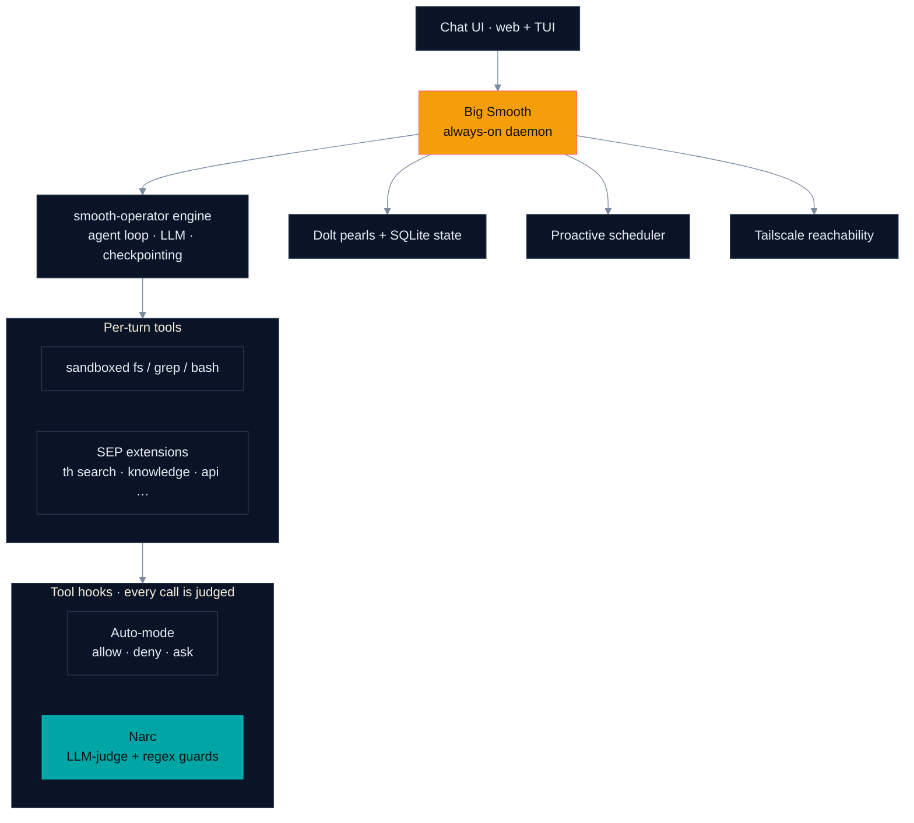

<p align="center">
  <a href="https://smoo.ai"></a>
</p>

<p align="center">
  <a href="docs/bench-history.md"></a>
  <a href="https://smoo.ai"></a>
  <a href="LICENSE"></a>
</p>

<p align="center">
  <a href="https://www.rust-lang.org/"></a>
  <a href="https://github.com/SmooAI/smooth/releases"></a>
</p>

<p align="center">
  <a href="#install"><b>Install</b></a> &nbsp;·&nbsp;
  <a href="#the-th-toolkit"><b>The toolkit</b></a> &nbsp;·&nbsp;
  <a href="#how-big-smooth-works"><b>Big Smooth</b></a> &nbsp;·&nbsp;
  <a href="#the-orchestration-superpower"><b>Orchestration</b></a> &nbsp;·&nbsp;
  <a href="#get-started"><b>Get started</b></a>
</p>

---

## `th` is the single binary that runs your whole AI-agent workflow.

One ~10MB Rust binary. **Zero runtime dependencies** — no Docker, no Node, no
Python. `th` gives you web search, your org's knowledge base, web crawling, a
coding TUI, and a shared work tracker from the terminal — and it's the engine
behind **Big Smooth**, the always-on AI agent you keep running on your machine.

```bash
brew install SmooAI/tools/th
```

If you write code with an AI assistant, `th` is the missing operating layer:
the primitives an agent needs (search, retrieval, crawl, memory, messaging) as
first-class CLI commands, plus a persistent agent that uses all of them for you.

---

## It scales past your laptop

`th` isn't just a local binary — it plugs into Smoo AI's cloud.

- **☁️ Cloud scale.** Your agents don't have to live on one machine. The same
  agent engine that powers your personal Big Smooth also runs **hosted org
  agents in Smoo AI's cloud** (`api.smoo.ai`), fronted by a gateway
  (`llm.smoo.ai`) that gives one key access to every major model. Personal agent
  on your laptop, fleet in the cloud — same engine, same tools.
- **🧩 Cloud marketplace.** Add new capabilities to your agents without
  rebuilding anything. `th ext search` browses the **extension marketplace** — a
  curated index plus community extensions tagged for Smooth — and `th ext install`
  drops one in. Big Smooth loads installed extensions per turn, so a new tool is
  live on the next message.

```bash
th ext search browser          # find extensions (curated + community)
th ext install npm:@scope/pkg  # install one (local dir, npm:, or git:)
```

---

## Install

### Homebrew (recommended — macOS + Linux)

```bash
brew install SmooAI/tools/th
```

That taps [SmooAI/homebrew-tools](https://github.com/SmooAI/homebrew-tools) and
installs `th`; `brew upgrade th` picks up future releases.

Platforms: Apple Silicon macOS, Linux x86_64/arm64. **Windows is via WSL** for
now — native Windows support is in flight.

### `curl | sh`

```bash
curl -fsSL https://raw.githubusercontent.com/SmooAI/smooth/main/install.sh | sh
```

### Build from source (the dev loop)

```bash
git clone https://github.com/SmooAI/smooth.git
cd smooth
pnpm install:th        # builds the web bundle + installs th to ~/.cargo/bin
```

Or just the binary: `cargo install --path crates/smooth-cli`.

Every subcommand is self-documenting — run `th --help` and `th <command> --help`
liberally.

---

## The `th` toolkit

`th` leads with four things you'll reach for every day. Each is a real command
you can run right now.

### 1. `th search` — web search from the terminal

Ranked web results without leaving your shell, served by Smoo AI's own search
stack. There's an anonymous free tier; sign in for deeper search and a
synthesized answer.

```bash
th search "rust axum websocket backpressure"
th search "sqlite wal checkpoint tuning" --answer   # synthesized answer (authed)
th search "who maintains ripgrep" --max 5 --json    # machine-readable
```

`--depth advanced` and `--scrape` (fetch full page content per result) unlock on
the authed tier. It's the web-facing companion to `th knowledge` (your docs) and
`th crawl` (one page).

> The search backend is still being built out — the free tier is intentionally
> capped, and advanced depth / answer synthesis are the authed surface.

### 2. `th knowledge` — RAG retrieval over your org's own knowledge base

`th knowledge search` runs **real semantic retrieval — the exact same RAG an
agent uses** — over your organization's own documents, backed by `api.smoo.ai`.
It returns the most relevant passages (name + content + relevance score), so you
(or an agent) can pull authoritative internal context straight into a coding
session. Grow the base with `th knowledge add-url` to ingest a whole site.

```bash
th knowledge search "how do we rotate the gateway keys"     # semantic RAG retrieval
th knowledge search "deploy runbook" --doc <doc-id> --max 5 # scope to one doc
th knowledge add-url https://docs.example.com               # crawl a site into the KB
th knowledge list                                           # what's in the KB
th knowledge upload ...                                     # add a text document
```

`list` / `show` / `content` / `update` / `delete` round out document management.
Sign in first with `th auth login`.

### 3. Agent features — Big Smooth, `th code`, and the agent loop

The same engine powers two ways to put an AI agent to work:

```bash
th daemon run  # start Big Smooth — the always-on personal AI agent (see below)
th code        # launch the interactive coding TUI
```

- **Big Smooth** is a persistent, chat-first agent that runs on your machine and
  can act on your Smoo AI org through `th` itself. [How it works ↓](#how-big-smooth-works)
- **`th code`** is a ratatui coding assistant — streaming chat, tool calls, a
  file browser, and git, with `fixer` / `mapper` / `oracle` / `heckler` lead
  roles (`--agent`), session resume (`--resume`), and a headless mode
  (`--headless --message …`) for scripting.
- Both run the **[smooth-operator](https://github.com/SmooAI/smooth-operator)**
  engine's agent loop (observe → think → act) with a tool registry, pre/post
  tool hooks, and built-in checkpointing.

### 4. `th crawl` — web crawling &nbsp; <sub>`PREVIEW · not yet GA`</sub>

Turn a page — or a whole site — into clean markdown through an authenticated
crawler with a real browser UA and JS rendering, so it gets pages a plain fetch
403s on.

```bash
th crawl scrape https://example.com/docs/page     # one page → markdown
th crawl map    https://example.com               # discoverable URLs, no content
th crawl crawl  https://example.com               # whole site → markdown
```

> **Preview.** `th crawl` is functional but **not yet GA** — the underlying
> `search.smoo.ai` crawler backend is still in flight. Expect rough edges and
> changing limits until it lands.

### And the rest of the belt

```bash
# SEP extensions — add tools/hooks/UI to agents without rebuilding the binary
th ext search <query>                 # browse the extension marketplace
th ext install npm:@scope/pkg         # install (local dir, npm:, or git:)
th ext list                           # installed extensions + trust state

# Pearls — the built-in, Dolt-backed work tracker (more below)
th pearls ready                       # what's ready to work on
th pearls create --title="..." --description="..."
th pearls show <id> / update <id> / close <id>

# Worktrees — feature work stays off main, always
th worktree create SMOODEV-XX-desc
th worktree list / merge / remove

# The Smoo AI platform API — no more hand-rolled curl to api.smoo.ai
th auth login                         # sign in (browser); --m2m for service accounts
th api orgs | agents | keys | members | crm | knowledge | jobs | testing …
```

`th` replaces the `curl … api.smoo.ai`, the web dashboard trip, and the Supabase
Studio poke — one authenticated, typed, paginated surface. Run `th --help` for
the full command list (config, files, booking, notify, jira, audit, and more).

---

## How Big Smooth works

**Big Smooth is the always-on AI agent built on `th`.** It's a chat-first
personal agent that runs as a durable service on your machine, built directly on
the [smooth-operator](https://github.com/SmooAI/smooth-operator) engine —
Smooth's own agent loop, LLM client, and tool system. You talk to it; it uses
the whole `th` toolkit on your behalf, including acting on your Smoo AI org
through `th` commands.


```mermaid
%%{init: {'theme':'base','themeVariables':{
  'background':'#020618','primaryColor':'#0b1426','primaryTextColor':'#e6edf6','primaryBorderColor':'#2b3a52',
  'lineColor':'#7c8aa0','secondaryColor':'#0b1426','tertiaryColor':'#0b1426','fontFamily':'ui-sans-serif, system-ui, sans-serif',
  'clusterBkg':'#0b1426','clusterBorder':'#22304a'}}}%%
flowchart TB
    UI["Chat UI · web + TUI"] --> DAEMON
    DAEMON["Big Smooth<br/>always-on daemon"] --> ENGINE
    ENGINE["smooth-operator engine<br/>agent loop · LLM · checkpointing"] --> TOOLS

    subgraph TOOLS["Per-turn tools"]
        FS["sandboxed fs / grep / bash"]
        SEP["SEP extensions<br/>th search · knowledge · api …"]
    end

    subgraph SAFETY["Tool hooks · every call is judged"]
        AUTO["Auto-mode<br/>allow · deny · ask"]
        NARC["Narc<br/>LLM-judge + regex guards"]
    end

    TOOLS --> SAFETY
    DAEMON --> STATE["Dolt pearls + SQLite state"]
    DAEMON --> SCHED["Proactive scheduler"]
    DAEMON --> NET["Tailscale reachability"]

    classDef warm fill:#f49f0a,stroke:#ff6b6c,color:#1a0f00;
    classDef teal fill:#00a6a6,stroke:#00c2c2,color:#011;
    class DAEMON warm
    class NARC teal
```

- **Engine.** Runs the smooth-operator agent loop — observe → think → act — with
  a tool registry, streaming, and checkpointed session resume.
- **Tools + SEP extensions.** Each turn gets a fresh tool set: sandboxed
  filesystem/grep/bash plus **SEP extensions** (subprocess tools/hooks/UI over
  the Smooth Extension Protocol) installed with `th ext`. This is how Big Smooth
  reaches your Smoo AI org — it shells out to `th api …` through an extension.
- **Safety = tool hooks, not a VM.** Every tool call (extension tools included)
  passes two in-process hooks before it runs: an **auto-mode permission engine**
  (allow / deny / **ask**, with persistent allow-lists; `ask` parks on an access
  queue surfaced in the UI) and **Narc**, an LLM-judge layer with regex
  fast-paths that flags secret exfiltration, prompt injection, and dangerous
  operations. This replaced the old microVM isolation model — the safety now
  lives on the tool registry itself.
- **Durable state.** Work items live in the Dolt-backed pearl store; session and
  runtime state live in local SQLite. Nothing is lost across restarts.
- **Proactive + reachable.** A scheduler lets pearls "speak up" when their time
  arrives, and Tailscale serve makes the agent reachable from your other
  devices.

### Run it

```bash
th auth login          # sign in to Smoo AI (browser flow)
th model login         # add an LLM provider key (or point at the Smoo AI gateway)
th daemon run          # boot Big Smooth (serves its chat UI same-origin on :8788)
th daemon status       # health check
```

Keep it running across reboots with the native service manager (no sudo, no
system daemons):

```bash
th service install     # LaunchAgent (macOS) / systemd --user (Linux)
th service status
th service logs -f
```

> **Reachability note.** Big Smooth binds to loopback only by default
> (`127.0.0.1:8788`). Set `SMOOTH_ADDR` to change the bind. For access from your
> other devices, expose it over your tailnet with `tailscale serve` (→ `:8443`)
> rather than opening the raw bind — the API has no authentication today.

---

## The orchestration superpower

Here's the force-multiplier: **`th` gives a fleet of AI coding agents a shared
inbox and a shared brain.** Run several AI coding agents at once — across
worktrees, machines, or harnesses — and let them coordinate instead of stepping
on each other.

- **`th msg` + `th agent` — the shared inbox.** Any process that can run `th`
  registers as a named agent (`th agent register`) and sends agent-to-agent mail
  (`th msg send --to <name|all>`, `th msg inbox`, `th msg watch`). It's
  harness-agnostic — your AI coding agents talk to each other regardless of what
  each one is running under.
- **`th pearls` — the shared brain.** One Dolt-backed, version-controlled work
  tracker that every agent reads and writes: a dependency graph of work items,
  synced over git's own `refs/dolt/data` ref. One agent files a pearl, another
  claims it, a third closes it — with full history, no central server.

```bash
# Agent A registers and picks up ready work
th agent register --name builder
th pearls ready
th pearls update th-abc123 --status=in_progress

# Agent A hands off to Agent B over the shared inbox
th msg send --to reviewer "th-abc123 ready for review — tests green on my branch"

# Agent B is watching the inbox and pulls the shared work tracker
th msg watch
th pearls show th-abc123
```

Give your coding agents a shared inbox and a shared brain, and a pile of
independent agents becomes a coordinated team.

---

## Get started

```bash
brew install SmooAI/tools/th   # or: curl -fsSL https://raw.githubusercontent.com/SmooAI/smooth/main/install.sh | sh
th auth login                  # sign in to Smoo AI
th search "hello world"        # try the free web search
th daemon run                  # boot Big Smooth
th --help                      # explore everything else
```

### Links

- **Using `th`** — [`docs/Engineering/Using-th-CLI.md`](docs/Engineering/Using-th-CLI.md)
- **Extending Smooth** (MCP, plugins, SEP extensions) — [`docs/extending.md`](docs/extending.md)
- **Security model** — [`SECURITY.md`](SECURITY.md)
- **Contributor guide** (build, test, worktree workflow) — [`CLAUDE.md`](CLAUDE.md)
- **The smooth-operator engine** — [github.com/SmooAI/smooth-operator](https://github.com/SmooAI/smooth-operator)

### Workspace

```
smooth/
├── crates/
│   ├── smooth-cli/          # Binary — the `th` clap entry point
│   ├── smooth-daemon/       # Big Smooth — the always-on agent runtime
│   ├── smooth-code/         # ratatui coding TUI
│   ├── smooth-web/          # embedded React + Vite SPA
│   ├── smooth-pearls/       # Dolt-backed pearl (work-item) tracker
│   ├── smooth-policy/       # policy types + auto-mode permission engine
│   ├── smooth-tools/        # sandboxed fs/grep/bash agent tools
│   ├── smooth-api-client/   # api.smoo.ai client
│   ├── smooth-cast/         # LLM cast / model routing
│   ├── smooth-diver/        # deep-research / exploratory agent
│   └── …
├── Cargo.toml               # workspace root
└── install.sh               # curl installer
```

The [smooth-operator](https://github.com/SmooAI/smooth-operator) agent engine is
consumed as an external crate — the daemon runs *on* it.

---

## 🧩 Part of Smoo AI

Smooth is built and open-sourced by **[Smoo AI](https://smoo.ai)** — the
AI-powered business platform with AI built into every product: CRM, customer
support, campaigns, field service, observability, and developer tools.

- 🚀 **Smooth on the platform** — [smoo.ai/th](https://smoo.ai/th)
- 🧰 **More open source from Smoo AI** — [smoo.ai/open-source](https://smoo.ai/open-source)

## 🤝 Contributing

Issues and PRs welcome. All feature work happens in a git worktree
(`th worktree create`) — see [CLAUDE.md](CLAUDE.md) for build, test, and workflow
conventions, and [SECURITY.md](SECURITY.md) for the security model.

## 📄 License

MIT © [Smoo AI](https://smoo.ai). See [LICENSE](LICENSE).

---

<p align="center">
  Built by <a href="https://smoo.ai"><strong>Smoo AI</strong></a> — AI built into every product.
</p>
