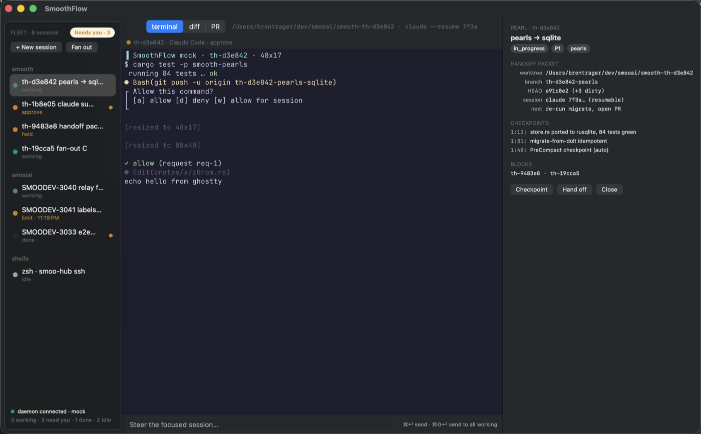
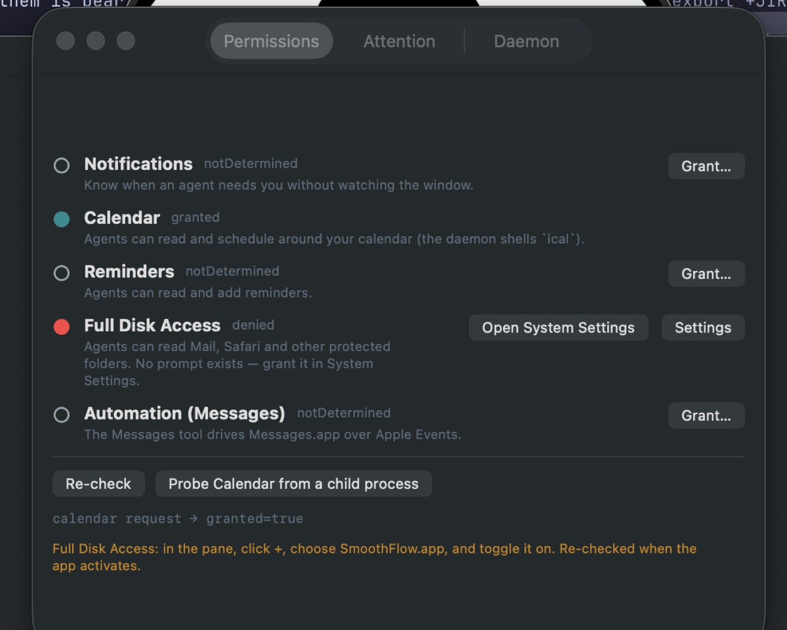
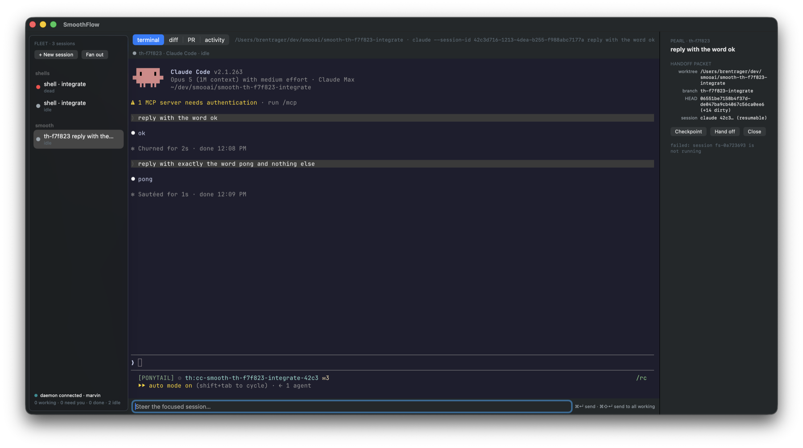
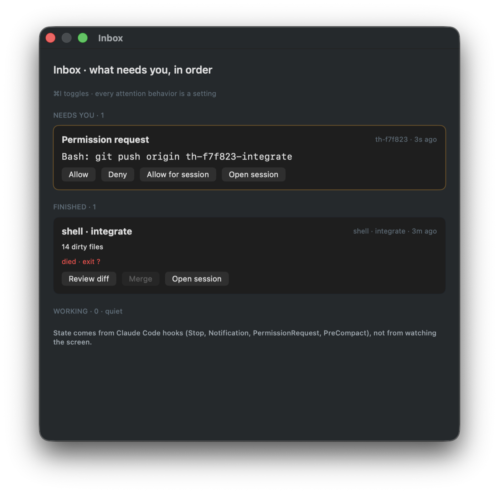
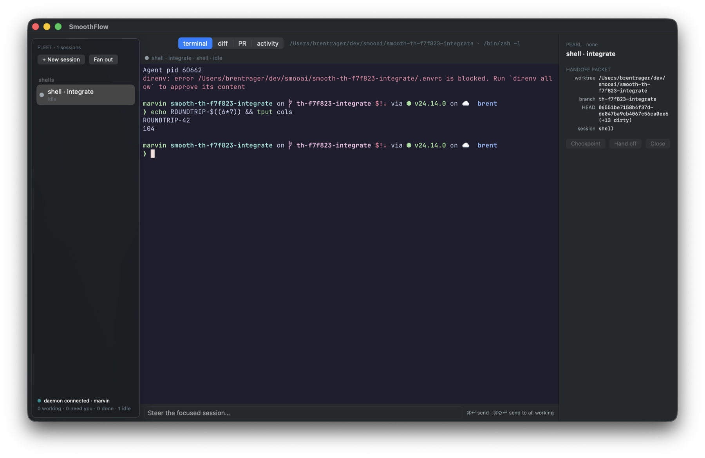
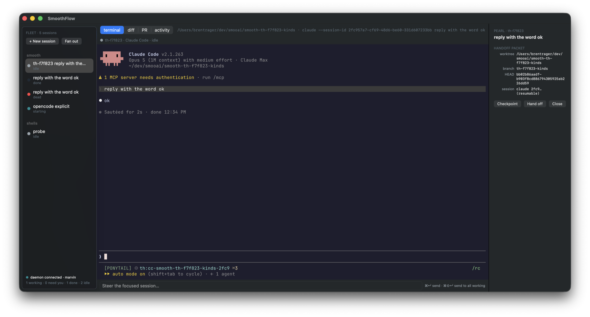
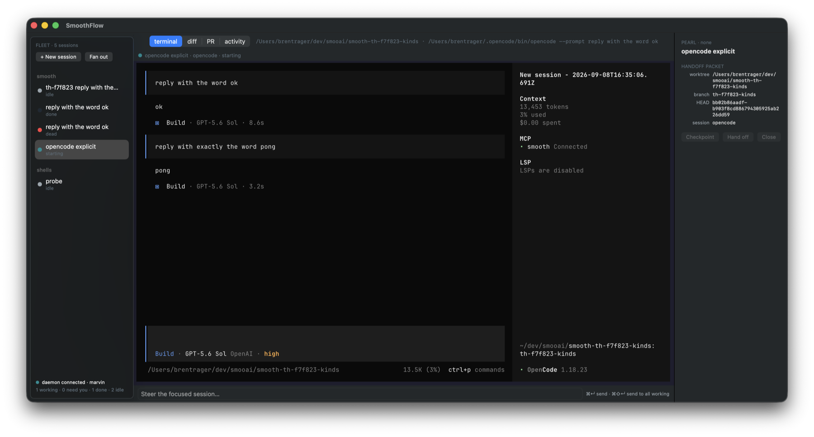
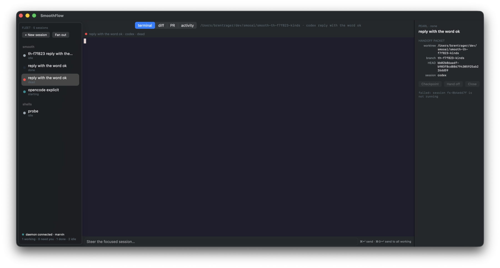
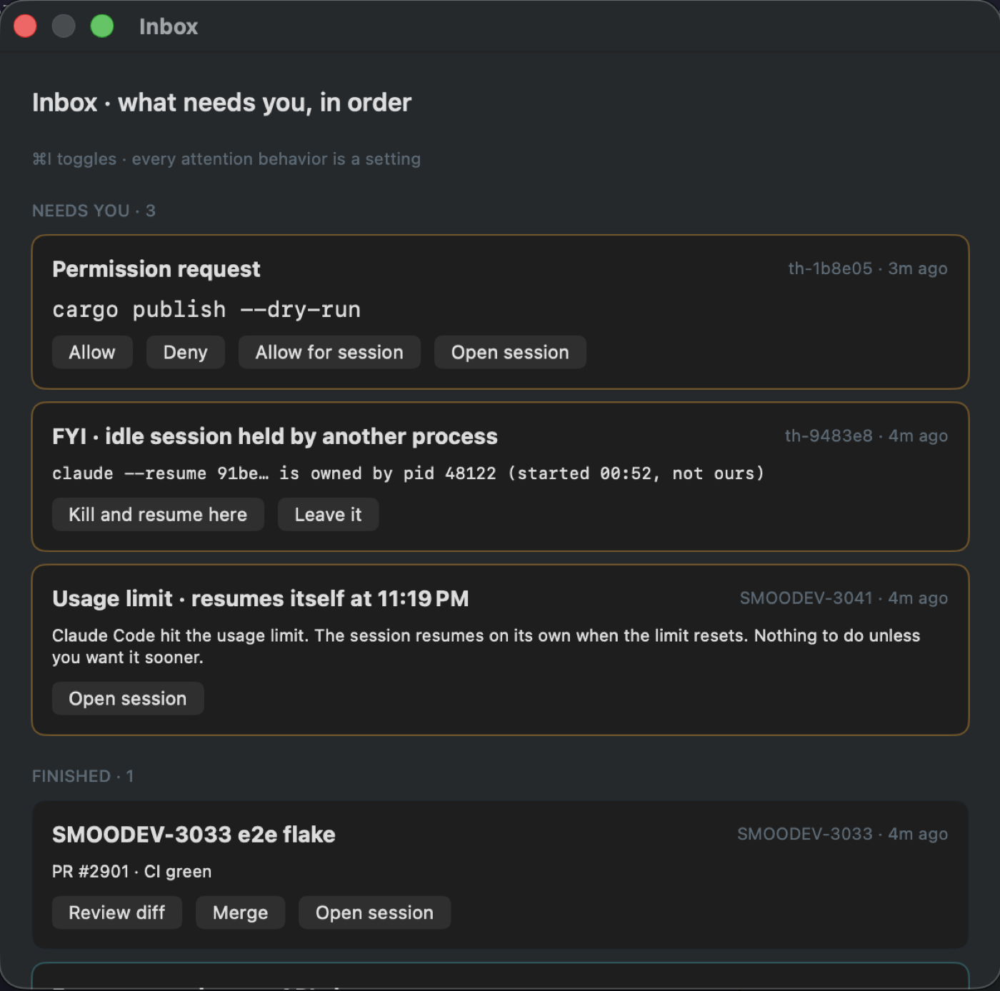
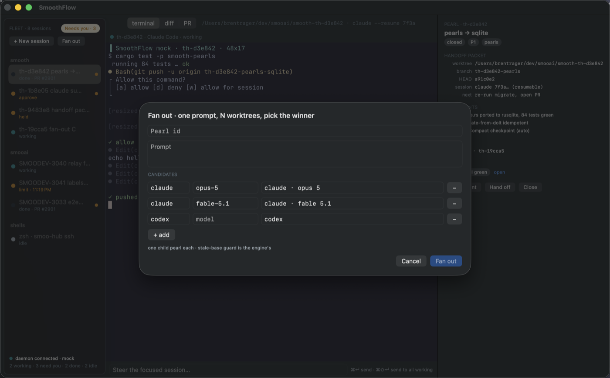

# SmoothFlow — the macOS shell

Pearl th-f7f823 (lane B of the SmoothFlow epic th-6ac036). Source: `apps/smoothflow/`.

SmoothFlow is the native macOS fleet console for Smooth agents: a sidebar of
every session grouped by project, a real terminal per session (libghostty), an
inbox of what needs a human, and a pearl rail. **The app holds no state.** Every
fact on screen arrived as a `flow.*` frame from the engine (`smooth-flow`, lane
A, hosted in `smooth-daemon`); every decision leaves as a `flow.*` frame. The
protocol is [`smoothflow-protocol.md`](../../apps/smoothflow/mock/protocol.md)
(v0 contract, mocked by `apps/smoothflow/mock/server.mjs`); the engine's own
account is [`SmoothFlow.md`](SmoothFlow.md). The shell was built against the
mock and then integrated with the real engine (section below).



## Shape

```
apps/smoothflow/
├── project.yml                  xcodegen spec (the .xcodeproj is generated, gitignored)
├── Info.plist / entitlements.plist   hand-maintained — see "xcodegen traps"
├── LaunchAgents/…daemon.plist   SMAppService agent, copied to Contents/Library/LaunchAgents
├── Resources/   SmoothFlow.icns + SVG masters, MenuBarTemplate.png (status item glyph)
├── Sources/
│   ├── Flow/        FlowFrame (codec) · FlowStore (reducer) · FlowClient (WS) · DaemonAddress · DaemonManager
│   ├── Terminal/    GhosttyRuntime (one ghostty_app) · TerminalSurfaceView (NSView per session)
│   ├── UI/          MainWindow (AppKit split) · CenterViewController (tabs, splits, steer bar)
│   │                FleetSidebar · PearlRail · InboxView · Sheets · SettingsView (SwiftUI in NSHostingView)
│   ├── Permissions/ Permissions (TCC status + asks) · AttentionNotifier (attention → UNNotification)
│   └── App/         AppController (coordinator) · AppDelegate (menus, shortcuts)
├── Tests/           XCTest: frame codec, store reducer, notification mapping, address resolution
├── mock/server.mjs  zero-dependency mock flow engine (node)
└── scripts/         ensure-ghosttykit.sh · ghosttykit.lock · build-release.sh · bump-version.sh · tcc-probe.sh
```

AppKit owns the window, splits, terminal, tab strip, steer bar and menus;
the list/card/form surfaces (sidebar, rail, inbox, sheets, settings) are SwiftUI
hosted in `NSHostingView` — same product, a third of the lines.

## Terminal: libghostty in MANUAL I/O mode

The engine owns every PTY (agents run under tmux on the engine side). The
shell therefore uses the manaflow-ai/ghostty fork's **manual I/O surface
mode** (`GHOSTTY_SURFACE_IO_MANUAL`): ghostty spawns nothing, `flow.output`
bytes are pushed in with `ghostty_surface_process_output`, and whatever the
user types comes back out of the `io_write_cb` already terminal-encoded and is
sent as `flow.input`. Upstream ghostty has no such API — this is why the pinned
`GhosttyKit.xcframework` is the fork's prebuilt (see `scripts/ghosttykit.lock`;
`ensure-ghosttykit.sh` verifies the sha256 and refuses anything else). It is
linked as the raw static archive + module map (`OTHER_LDFLAGS` /
`SWIFT_INCLUDE_PATHS` in `project.yml`), not as an xcframework dependency: the
moment a SwiftPM package (Sparkle) is in the project, Xcode's build description
rejects the fork's xcframework with "There is no XCFramework found at …" even
though it is right there. Fetch it **before** `xcodegen generate` — a project
generated against a missing `Vendor/` fails the same way after the fetch.

One `TerminalSurfaceView` per session, created on first focus and kept for the
session's life, so scrollback lives in the surface. Keys go through
`interpretKeyEvents` (IME/dead keys work) then `ghostty_surface_key`; mouse,
scroll (precise + momentum bits), resize (`flow.resize` on grid change), focus
and content scale are forwarded. `⌘D` splits the surface area (NSSplitView,
no third-party splitter — bonsplit's submodule is not vendored here).

## Daemon lifecycle and TCC — the part cmux gets wrong

macOS attributes a TCC decision to the **responsible process**, and only an app
bundle's main executable launched through LaunchServices can _ask_. A daemon
started from a terminal inherits the terminal's grants and can never prompt, so
"grant Calendar to Smooth" silently fails. SmoothFlow therefore never adopts a
daemon it did not start:

- **Child mode (default):** the app spawns `smooth-daemon operator --addr 127.0.0.1:<free port>`
  (binary: bundled `Contents/MacOS/smooth-daemon` → `~/.cargo/bin` → `PATH`),
  restarts it with backoff if it dies, and kills it on quit. The daemon writes
  `~/.smooth/daemon.addr` as usual so `th flow` finds it.
- **LaunchAgent mode (Settings ▸ Daemon):** `SMAppService.agent` registers
  `Contents/Library/LaunchAgents/ai.smoo.smoothflow.daemon.plist` (fixed port
  8791). Only offered when the daemon is bundled, i.e. release builds.
- **tmux:** the app starts the `smoothflow` tmux server itself
  (`tmux -L smoothflow`) and kills it on quit — see the matrix for why.
- `SMOOTHFLOW_DAEMON_ADDR` / Settings ▸ Daemon override the address for the
  mock server. `~/.smooth/daemon.addr` is deliberately **not** consulted: it
  advertises whichever daemon started last, terminal ones included.
- `SMOOTHFLOW_DAEMON_BIN` / Settings ▸ Daemon ("launch this binary") points a
  dev build at an engine built elsewhere (it wins over bundled → `~/.cargo/bin`
  → `PATH`). This is how the integration below was run.
- The child is spawned through a one-line `sh` supervisor that exits with the
  app: macOS has no parent-death signal, and an app crash used to leave the
  daemon (and its supervision loop) running — seven such orphans were found
  after one day of shell development. The supervisor records the daemon's pid
  in `~/.smooth/smoothflow-daemon.pid` (`$SMOOTHFLOW_DAEMON_PIDFILE`).

### Quit (th-6198bf)

Every quit sender — ⌘Q, the app and status-item menus, AppleScript `quit`,
`NSRunningApplication.terminate()` (what the release lane uses to install over
a running copy) — arrives as `NSApplication.terminate(_:)`, and
`applicationShouldTerminate` takes the fleet down **before** answering
`.terminateNow`: disconnect, stop the child daemon, kill the app-owned tmux
server. It never answers `.terminateLater` (nothing to forget to reply to) or
`.terminateCancel` (quit means quit); `applicationWillTerminate` runs the same
idempotent shutdown for the paths that skip the delegate question.

The stop is **bounded**. It used to be `terminate()` + `waitUntilExit()` on the
main thread, which blocks for exactly as long as the child tree takes to die —
and a daemon that ignores SIGTERM never does, so the Quit Apple event was
handled, `applicationWillTerminate` ran, and the app simply never exited (the
0.2.0 symptom: "quit did nothing, had to kill the pid"). Now the supervisor
itself escalates — TERM the daemon, wait up to 3 s, SIGKILL it — and the app
waits at most 5 s for the supervisor before SIGKILLing the supervisor and the
pid it recorded. Reproduced and pinned with a `trap '' TERM` daemon: quit
completes in ~4 s instead of never; a TERM-honoring daemon is gone in ~1 s.

### What the child daemon is started with

| env                          | value                              | why                                                                                 |
| ---------------------------- | ---------------------------------- | ----------------------------------------------------------------------------------- |
| `SMOOTH_FLOW_TMUX_SOCKET`    | `smoothflow`                       | agents run under the **app-owned** tmux server (the TCC story below)                |
| `SMOOTH_LOCAL_TOKEN`         | `~/.smooth/operator-token` or new  | every `/api/flow/*` route but `/hooks` is token-gated; app and child agree          |
| `SMOOTH_OPERATOR_DB`         | `~/.smooth/smoothflow-operator.db` | never share Big Smooth's operator store                                             |
| `SMOOTH_FLOW_DB`             | `~/.smooth/smoothflow-flow.db`     | a second daemon on the same `flow.db` marks our rows "process vanished" (th-4f7866) |
| `SMOOTH_ALLOW_SECOND_DAEMON` | `1`                                | Big Smooth may be running; we are a separate product on our own port                |
| `SMOOTH_TAILSCALE_SERVE`     | `0`                                | Big Smooth owns the tailnet port; phones reach SmoothFlow through the relay         |

The token rides as `?token=` on the WebSocket and `X-Smooth-Token` on HTTP.

### TCC matrix (measured 2026-09-07, macOS 26.4, Developer-ID-signed ad-hoc-equivalent build)

Probe: `scripts/tcc-probe.sh` — prints the responsible pid
(`responsibility_get_pid_responsible_for_pid`, `scripts/responsible.c`; root-free
unlike `launchctl procinfo`), an FDA read (`open()` on TCC.db — `stat()` is not
gated), and `smooth-daemon tcc calendar`.

| Permission            | Who asks                                                           | Who inherits                                     | How verified                                                                                                                                    |
| --------------------- | ------------------------------------------------------------------ | ------------------------------------------------ | ----------------------------------------------------------------------------------------------------------------------------------------------- |
| Notifications         | app (`UNUserNotificationCenter.requestAuthorization`)              | n/a — only the app posts                         | `Permissions.refresh()` reads `getNotificationSettings`                                                                                         |
| Calendar              | app main executable (`EKEventStore.requestFullAccessToEvents`)     | daemon, tmux server, every pane, grandchild tmux | prompt appears (screenshot below); pane in app's tmux: `calendar: granted`, `ical calendars` lists calendars; terminal shell: `not-determined`  |
| Reminders             | app (`requestFullAccessToReminders`)                               | same as Calendar                                 | same code path; `smooth-daemon tcc reminders`                                                                                                   |
| Full Disk Access      | nobody can prompt — Settings pane deep link + re-probe on activate | daemon, tmux, panes                              | pane in app's tmux: `fda=denied` while the same probe from the terminal (cmux has FDA) is `granted` — attribution follows the app, not the user |
| Automation (Messages) | first Apple Event from the app (`NSAppleEventsUsageDescription`)   | children                                         | `AEDeterminePermissionToAutomateTarget(askUserIfNeeded: false)` reads status without prompting                                                  |

**Attribution findings (the question the lane was asked):**

| Process                                                                    | Responsible pid                   | Notes                                                                                                                                      |
| -------------------------------------------------------------------------- | --------------------------------- | ------------------------------------------------------------------------------------------------------------------------------------------ |
| SmoothFlow launched via `open`                                             | itself                            | launched from a shell instead: responsible = the terminal, FDA/Automation read as _granted_ — a false reading. Always test through `open`. |
| `smooth-daemon` child of the app                                           | the app                           |                                                                                                                                            |
| `tmux -L smoothflow` server started by the app (daemonizes, ppid 1)        | **the app**                       | daemonizing does not break attribution                                                                                                     |
| pane inside that server                                                    | the app                           | `calendar: granted` after the app's grant                                                                                                  |
| tmux server started _from inside_ that pane (models daemon → tmux → agent) | **the app**                       | any depth inherits while the app lives                                                                                                     |
| the same servers **after the app quits**                                   | **themselves** (`bash`, `tmux`)   | attribution is lost the moment the responsible app exits; what an orphan then gets depends on its own binary's TCC rows — unpredictable    |
| relaunched app adopting the surviving server                               | still the old server → **itself** | adoption does not re-attribute                                                                                                             |

So: **a daemon restart is fine (the app is still the responsible process), an
app quit is not.** SmoothFlow kills its `smoothflow` tmux server on quit and
recreates it on launch (`DaemonManager.startTmuxServer` does `kill-server` first),
and the engine resumes agents with `--resume` — quitting the console is a
fleet restart by design, never a fleet with unattributed processes. Lane A's
engine must launch agents under `tmux -L smoothflow` (the app-owned server)
for this to hold — filed as a follow-up pearl.



### Two build traps that silently kill every prompt

Both were hit while measuring the matrix, both produce `granted=false`, no
error, status `notDetermined`, nothing in tccd's log:

1. **xcodegen's `info:` and `entitlements:` keys regenerate those files** as
   near-empty plists. `project.yml` therefore points at them with plain
   `INFOPLIST_FILE` / `CODE_SIGN_ENTITLEMENTS` build settings and the files
   are hand-maintained. `build-release.sh` greps both back out of the signed
   app and fails the build if either is missing.
2. **Hardened runtime without `com.apple.security.personal-information.calendars`**
   (same for `.reminders`) — known from Big Smooth (th-36da65), still true.

## Integration with the real engine (2026-09-08)

Run against `smooth-daemon` built from lane A's branch (`th-7f0af3-flow-engine`),
launched by the app via `SMOOTHFLOW_DAEMON_BIN`. Everything below was driven
through the app (keystrokes into the ghostty surface, ⌘⌥R, ⌘⌥Y, the steer
bar) and cross-checked with `th flow ls/snapshot` against the same daemon.

| Path                                                  | Result                                                                         |
| ----------------------------------------------------- | ------------------------------------------------------------------------------ |
| `flow.hello` → sidebar                                | fleet listed, first **live** session focused                                   |
| shell session: attach → output → typed input → output | `echo ROUNDTRIP-42` round-trips through the surface                            |
| window resize → `flow.resize`                         | `tput cols; tput lines` follows the window (124×43 → 92×39)                    |
| claude session (`reply with the word ok`)             | starting → working → idle from hooks; steer bar sends `flow.send`, reply lands |
| `flow.kill{resume:true}` (⌘⌥R)                        | relaunched as `claude --resume <id>`, surface re-attaches under the new pid    |
| `PermissionRequest` hook → inbox card → ⌘⌥Y           | the long-polled hook returns `decision.behavior = allow`; session → working    |
| `flow.snapshot` / `GET …/handoff`                     | pane text and the pearl rail (branch, HEAD, dirty count, resumable session id) |

What did not match the mock, all fixed on the shell side:

- **Text frames only.** The engine's WS loop reads `Message::Text`; the shell
  sent binary and every frame was silently skipped.
- **Token.** The engine gates every flow route (additive to v0). The shell
  now resolves the same token the daemon provisions.
- **Ghostty actions off the main thread.** The real engine's first attach is a
  full redraw; ghostty then raises actions from its renderer thread and
  `MainActor.assumeIsolated` trapped (crash on first attach). Off-main actions
  are copied and hopped to main.
- **Resize never reached the engine.** `ghostty_surface_size` still reports the
  old grid right after `ghostty_surface_set_size`; the grid is re-read shortly
  after and only real changes become `flow.resize`.
- **Re-attach.** After a reconnect (`flow.hello`) or a relaunch (a `flow.session`
  with a new pid) the engine has no attachment for us; surfaces re-attach.
  Done/dead rows are never attached (the engine refuses, and it was the first
  thing the app focused).
- **`flow.error.ref`** may be any JSON, not just an int.

Engine-side findings filed as pearls (not patched here): th-f4073b
(`handoff.dirty[0]` loses its first character), th-3e6b1b (a second daemon
overwrites `~/.smooth/daemon.addr`), th-4f7866 (a daemon supervises rows on a
socket it does not own → "process vanished").

Additive frames the shell already decodes for the engine follow-up:
`flow.event {id, event_id, at, kind, text}` (the **activity** tab, ⌘⌥4 — amber
only on the kinds that mean "needs you"), `flow.handoff {id, …GET body}` (pushed
pearl rail), and the client sends `flow.hello {client:"smoothflow", version}`
on connect.

| Claude session, steered from the bar           | Inbox card from a real `PermissionRequest` hook |
| ---------------------------------------------- | ----------------------------------------------- |
|  |     |



### Harness kinds through the app (2026-09-08, engine @72c995eb)

`flow.new` with `prompt: "reply with the word ok"` for each kind, then steer,
then `flow.kill{resume:true}`. The daemon's `PATH` came from the app, which
does **not** contain cmux's CLI shim directory, so `claude` resolved to the
real binary; a daemon started from a cmux terminal would not (th-5c5457).

| kind     | launched?                                                                                                                                                                                                                                 | state source                                                                                   | steer        | kill + resume                                                                                    |
| -------- | ----------------------------------------------------------------------------------------------------------------------------------------------------------------------------------------------------------------------------------------- | ---------------------------------------------------------------------------------------------- | ------------ | ------------------------------------------------------------------------------------------------ |
| claude   | yes — engine default `claude --session-id <uuid> <prompt>`, real `~/.local/bin/claude`                                                                                                                                                    | hooks: starting → working → idle in ~5 s                                                       | yes          | yes — `claude --resume <id>`, same transcript, surface re-attaches                               |
| opencode | **not with the engine default**: `opencode "<prompt>"` treats the prompt as the `[project]` positional, exits 0, and is reported `done` (th-b423aa). Yes with explicit argv `~/.opencode/bin/opencode --prompt "<prompt>"` — replied `ok` | none — no hooks and the scraper only knows Claude's pane, so it sits at `starting` (th-069c9e) | yes (`pong`) | relaunch of the original argv = a **fresh** opencode session (no `-s <id>`); surface re-attaches |
| codex    | **no** — there is no codex CLI on this machine (only cmux's shim, and only inside cmux's PATH): exit 127, three resume attempts, then `dead` · `crashed`                                                                                  | —                                                                                              | —            | —                                                                                                |

| Claude                                       | OpenCode (explicit argv)                         | Codex (no CLI installed)                   |
| -------------------------------------------- | ------------------------------------------------ | ------------------------------------------ |
|  |  |  |

Shell-side fix from this pass: a done/dead row's surface no longer sends
`flow.input`/`flow.resize` (the engine answered "not running" for each and it
landed in the rail).

### TCC probe from a pane the real engine created

`scripts/tcc-probe.sh` run inside `fs-…`, a shell session the engine launched
on the app-owned `tmux -L smoothflow` server:

```
engine-pane  pid=69299  ppid=60248  responsible=58932(SmoothFlow)  fda=denied  calendar=calendar: granted
terminal     pid=69721  ppid=65831  responsible=1385(cmux)         fda=granted calendar=calendar: not-determined
```

The Calendar prompt appeared **for SmoothFlow** the moment the probe ran
`smooth-daemon tcc calendar` in that pane (the ad-hoc signature changes per
build, so a rebuilt Debug app is asked again); after Allow the pane reads
`granted`, while the same probe from the terminal is `not-determined` and reads
FDA the other way round. Attribution follows the app through the real
engine's daemon → tmux → pane chain, exactly as the matrix predicted.

## Attention → notifications

`AttentionNotifier.notification(for:settings:)` is a pure map from a session
to a notification (or nil). Every reason — permission, question, usage limit
(with resume time), crashed, held, finished — has its own toggle in
Settings ▸ Attention (`NotifySettings`, UserDefaults). The notification's
`userInfo` carries the session id and request id; clicking it focuses the
session, and permission notifications carry Allow / Deny actions that send
`flow.approve` straight from Notification Center. One live notification per
session (identifier `session:<id>`), cleared when the session is focused.



### Closing a finished session (th-883ce9)

The finished card's **Close…** is the shell side of `flow.close`
([SmoothFlow.md](SmoothFlow.md#flow.close)). It never fires blind: a confirm
sheet names each action with its target — _close pearl `<id>`_ (on when the
row has a pearl), _remove worktree `<path>` and delete branch `<branch>`_ (on
when the row lives in its own worktree; the main checkout is never offered) —
and states the rule up front: a dirty or unmerged worktree is refused with
nothing touched. The frame carries a client `seq`; the engine echoes it as
`flow.error.ref`, so a refusal lands on **that card** in the engine's words
with **Force close** (resends with `force`) and **Keep it**. Success is just
`flow.session.removed`: the card and the sidebar row go. The mock
(`mock/server.mjs`) refuses `fs-3034dddd` until forced, so the XCUITest
covers both paths without a real worktree.

## Keyboard

| Keys      | Action                                     |
| --------- | ------------------------------------------ |
| ⌘N / ⌘⇧N  | new session / fan out                      |
| ⌘I        | inbox                                      |
| ⌘↩ / ⌘⇧↩  | steer focused / steer all working          |
| ⌘1…9      | focus session N                            |
| ⌘⌥Y / ⌘⌥N | allow / deny the focused session's request |
| ⌘⌥R / ⌘⌥K | kill & resume / kill                       |
| ⌘⌥1/2/3/4 | terminal / diff / PR / activity tab        |
| ⌘D / ⌘⇧W  | split / close split                        |



## Icon

`Resources/SmoothFlow.icns` (wired by `CFBundleIconFile`; the `.icns` is built
with Apple's 824-in-1024 squircle geometry) — the `th` mark floating on three
Smoo-gradient streams (gold / orange / coral) on the Presence ground. Masters:
`Resources/macos-1024.svg` and `Resources/icon-source.svg`.
`Resources/MenuBarTemplate.png` (+`@2x`) is the monochrome glyph the menu-bar
status item uses (`isTemplate = true`, so it follows the bar's appearance). The
status item is how you get the window back after closing it — the app keeps
running the fleet without one — and carries Open / Inbox / Check for Updates /
Settings / Quit.

## Release and OTA

**Version** lives in one place: `Info.plist` `CFBundleShortVersionString`, kept
equal to `CFBundleVersion` (Sparkle compares the latter, so it has to move on
every release). Bump with `scripts/bump-version.sh 0.2.1`; `build-release.sh`
refuses a mismatch. Big Smooth's desktop version is likewise manual and separate
from the root `package.json`/changeset version — `sync-versions.mjs` does not
touch either app.

**Build** — `scripts/build-release.sh`: xcodegen → Release `xcodebuild`
(Sparkle 2 resolved via SwiftPM, `project.yml` `packages:`) → bundle
`smooth-daemon` **and** `th` into `Contents/MacOS` (`SMOOTH_DAEMON_BIN` /
`SMOOTH_TH_BIN`, default `~/.cargo/bin`; `DaemonManager` puts that dir first on
the child's `PATH`) → codesign inside-out (the two binaries, then
Sparkle.framework's XPC services / Autoupdate / Updater.app / framework, then
the bundle with `entitlements.plist` + hardened runtime — never `--deep`) →
`dist/SmoothFlow-<version>-arm64.dmg` → `scripts/macos/notarize-and-staple.sh`.
The script greps the calendar entitlement, the usage strings, `SUPublicEDKey`
and the `.icns` back out of the signed app and fails if any is missing.

**OTA** — Sparkle 2 (`SPUStandardUpdaterController` in `AppDelegate`, checks
hourly + "Check for Updates…" in the app menu and the status item). `Info.plist`
carries `SUFeedURL = https://downloads.smoo.ai/smoothflow/appcast.xml` and
`SUPublicEDKey`. The app is not sandboxed, so no installer-launcher service or
XPC entitlements are needed; `disable-library-validation` is already on for
the bundled daemon.

**Sparkle key** — one EdDSA pair, generated with Sparkle's `generate_keys
--account SmoothFlow` (private half in the generating Mac's keychain, exported
with `-x`). The public key is `SUPublicEDKey`; the private key is the
`SMOOTHFLOW_SPARKLE_PRIVATE_KEY` GitHub Actions secret (set with `gh secret set
… --body "$(cat key)"` — command substitution strips the trailing newline,
which is what a byte-comparing consumer needs). Losing the private key means
shipping a new public key, which installed apps will refuse — so an installed
0.x can never update again and every user reinstalls. Keep the keychain copy.

**Cutting a release**

1. `apps/smoothflow/scripts/bump-version.sh <x.y.z>` + a changeset, merge to `main`.
2. `gh workflow run smoothflow-publish.yml --ref main` (or `-f tag=<ref>`).
   Manual dispatch, not on merge — same as `desktop-publish.yml`. The run:
   builds `smooth-daemon` + `th` (release, stale-binary guard th-76a353), runs
   `build-release.sh` with the Developer ID cert + notary key from the
   `desktop-publish.yml` secrets, verifies `spctl`, then runs the resolved
   package's own `generate_appcast` over `dist/` (signed with the secret) and
   `aws s3 sync`s to the Downloads bucket under `smoothflow/`:
   `SmoothFlow-<v>-arm64.dmg` (immutable), `appcast.xml` (no-cache) and the
   `latest-arm64.dmg` alias (no-cache).
3. Verify: `curl -s https://downloads.smoo.ai/smoothflow/appcast.xml | grep shortVersionString`.
   Installed apps offer it on the next hourly check.

What the first two publishes (0.2.0 → 0.2.1, 2026-09-09, th-b4e4de) taught:

- **The appcast carries only the version just published.** `generate_appcast`
  runs over the run's own `dist/`, which holds one DMG, so each publish
  replaces the feed rather than appending to it. Sparkle only needs the newest
  item; older `SmoothFlow-<v>-arm64.dmg` objects stay in the bucket (the sync
  never deletes) but drop out of the feed.
- **The notarization ticket is stapled to the DMG, not the app inside it.**
  `xcrun stapler validate` on the DMG passes; on `/Applications/SmoothFlow.app`
  it reports no ticket, while `spctl -a -t install` still says
  `Notarized Developer ID` (the online check). Both are correct — Sparkle
  installs from the DMG, and Gatekeeper accepts the app either way.
- **The bundled daemon rewrites `~/.smooth/daemon.addr` on every launch** with
  its own random loopback port, clobbering the address Big Smooth advertised.
  The app never reads that file, but `th`-driven tooling on the same machine
  does; PR #546 stops the child from writing it. Until it lands, restore the
  file after running SmoothFlow.
- **Two daemons, two supervisors.** On a Mac running both apps there are two
  `smooth-daemon` children: Big Smooth's (the advertised one, typically `:8899`
  or `:8787`) and SmoothFlow's (a second instance, random port, not advertised).
  Each app supervises only the child it spawned. Big Smooth's side is
  described in [`desktop/README.md`](../../desktop/README.md) ("Daemon
  supervision", th-4b189c): exit → `~/Library/Logs/Big Smooth/daemon.log` +
  respawn with backoff, `/api/mode` probed every 30s, tray line + About box.
  The daemon's own tracing lands in `~/Library/Logs/Big Smooth/smooth-daemon.log`
  via `SMOOTH_LOG_FILE`; SmoothFlow's child can be given the same env var to
  get its own file. When "the daemon" looks dead, check which one — the port
  and the log folder tell them apart (see the two-daemons note in the Big Smooth
  desktop doc).
- **The OTA loop end to end:** Check for Updates… → "SmoothFlow 0.2.1 is now
  available—you have 0.2.0" → Install Update → the 48 MB DMG downloads and
  the EdDSA signature verifies → "Ready to Install / Install and Relaunch" →
  the app relaunches as 0.2.1 in a few seconds, `spctl` still accepts it, and
  `otool -L` on the bundled daemon still shows only system libraries. The
  whole thing took about a minute on marvin.
- `tell application "SmoothFlow" to quit` from AppleScript was ignored by a
  running 0.2.0; `kill <pid>` (or ⌘Q) is what actually stops it before an
  install-over.

The publish role (`OtaPublishRole`, smooai `infra/ci/github-oidc.ts`) grants
`smoothflow/*` next to `bigsmooth/*`; the CDN serves the whole bucket.
`.github/workflows/smoothflow-mac.yml` stays the ad-hoc compile + XCTest gate on
PRs touching `apps/smoothflow/**`.

## Testing

Three layers, all on PR via `smoothflow-mac.yml`: `SmoothFlowTests` (pure XCTests:
frame codec, store reducer, notifier, daemon address), `MockServerUITests`
(XCUITest against `mock/server.mjs`) and `RealEngineUITests` (XCUITest against
`flow_e2e_server` + `fake-claude` — the real router/supervisor, a scripted agent).
Launch contract, identifiers and how to run:
[SmoothFlow-Testing-macOS.md](../Engineering/SmoothFlow-Testing-macOS.md).

## Gaps (pearls filed from the main checkout)

- th-c7041a — closed: the engine launches agents under the app-owned
  `tmux -L smoothflow` server; `smooth-daemon operator --tmux-socket` is the
  contract and the app sets `SMOOTH_FLOW_TMUX_SOCKET`.
- th-2c8c1f — the child shared `operator-storage.db` with Big Smooth. Closed
  by `SMOOTH_OPERATOR_DB` (and `SMOOTH_FLOW_DB`) above.
- th-e126cc / th-883ce9 — closed on both sides: `flow.close {id, close_pearl,
remove_worktree, force}` (and `POST /api/flow/sessions/{id}/close`,
  `th flow close`) closes the pearl, removes the merged worktree + branch and
  drops the row — see [SmoothFlow.md](SmoothFlow.md#flow.close). The finished
  card's **Close…** sends it (confirm sheet + force on refusal, below). "Merge"
  still opens the PR: merging is a review act, not something the shell does
  blind.
- th-6198bf — closed: AppleScript / `NSRunningApplication.terminate()` quit
  hung in `waitUntilExit()` on a child that did not exit on TERM. Quit is now
  bounded (supervisor TERM→KILL escalation + app-side backstop, see
  [Quit](#quit-th-6198bf)) and pinned by `QuitUITests`.
